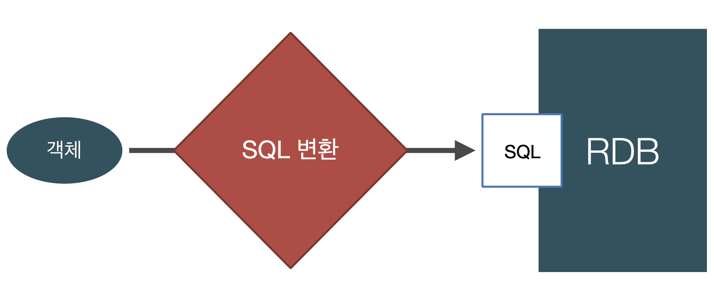
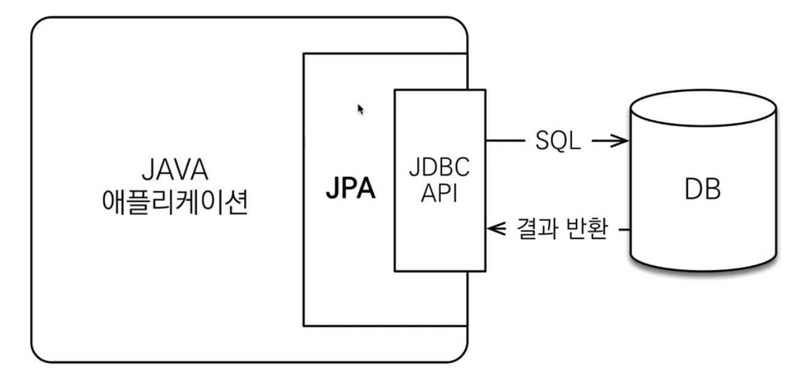
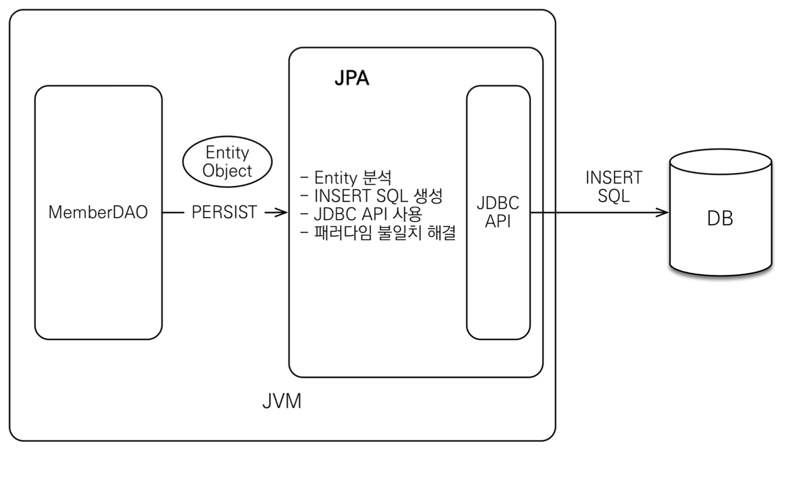

# JPA 소개

## SQL 중심적인 개발의 문제점

- 애플리케이션 객체지향 언어

  - 스칼라
  - 자바

- 데이터베이스 RDB
  - Oracle
  - MySQL

</br>

- 결국 지금 시대는 객체를 RDB에 저장한다.
- sql 개발 중심적인 문제

</br>

> JDBC를 써보면서 느낀점이 개발 이후 설계가 바뀔 경우 난감하다...  
> 반복적인 sql 수정 문제...

|                 패러다임의 불일치                 |
| :-----------------------------------------------: |
|  |

- 상속
- 연관관계
- 데이터 타입
- 데이터 식별 방법

> 상속 문제에서 collection으로 조회를 한다면 간단한 문제인데  
> RDB에서는 조금 난감하다.
> 즉 객체는 `참조`를 통해서 연관관계를 갖고  
> 테이블은 외래 키를사용하여 `Join을 수행...`
> 어떻게 객체다운 모델링을 고려하며 테이블에 접근할 것인가..?

</br>

- 처음 실행하는 SQL에 따라 탐색 범위 결정

```sql

SELECT M.*, T.*
FROM MEMBER M
JOIN TEAM T ON M.TEAM_ID = T.TEAM_ID

```

</br>

```java

member.getTeam() // OK
member.getOrder() // null

```

> 엔티티 신뢰 문제 발생...
> 반환되는 엔티티가 어떤 sql을 갖는지 모르기 때문에  
> 논리적으로 객체가 얽히는 문제

</br>

> SQL 중심적이 개발은 계층형 아키텍처, 진정한 의미의 계층 분할이 어렵다.

</br>

## JPA 본격 소개

</br>

- ORM이란?
  - 객체 관계 매핑
  - 객체는 객체대로 설계
  - 관계형 데이터베이스는 관계형 데이터베이스대로 설계
  - ORM 프레임워크가 중간에서 매핑
  - 대중적인 언어에서는 대부분 ORM 기술이 존재

</br>

- JPA는 애플리케이션과 JDBC 사이에서 동작

|                    JPA 위치                    |
| :--------------------------------------------: |
|  |

</br>

|                 JPA 동작 - 저장                 |
| :---------------------------------------------: |
|  |

</br>

- Entity 분석
- INSERT SQL 생성
- JDBC api 사용
- 패러다임 불일치 해결

</br>

> 어떻게 패러다임 불일치를 해결할 것인지?

</br>

- Hibernate
  - ORM 프레임워크
- JPA(자바 표준)
  - 인터페이스의 모음
  - JPA 2.1 표준 명세를 구현한 3가지 구현체
  - 하이버네이트, EclipseLink, DataNucleus

</br>

- JPA
  - 생산성
    - persist
    - find
    - setName
      - property 접근 변경만으로 update쿼리가 날아감
    - remove
  - 유지보수
    - 필드만 추가하면 된다.
    - sql은 jpa가 대신 처리
  - 패러다임 불일치를 해결해준다
    - 상속
      - 객체는 상속관계
      - 테이블은 슈퍼타입 서브타입 관계
  - 신뢰할 수 잇는 엔티티, 계층
    - jpa를 통해 자유롭게 객체 그래프 탐색
    - jpa가 lazy loading을 지원해주기 때문
  - 또한 동일한 트랜잭션에서 조회한 엔티티는 같음을 보장 해준다.
  - 1차 캐시와 동일성 보장
    - 같은 트랜잭션 안에서는 같은 엔티티를 반환
    - DB 격리 수준이 Read Commit이어도 애플리케이션에서 Repeatable Read 보장
  - 트랜잭션을 지원하는 쓰기 지연
    - 커밋할 때까지 INSERT SQL을 모은다
    - JDBC BATCH SQL 기능을 사용해서 한 번에 SQL 전송
  - 지연 로딩
    - 객체가 실제 사용될 때 로딩 된다.
