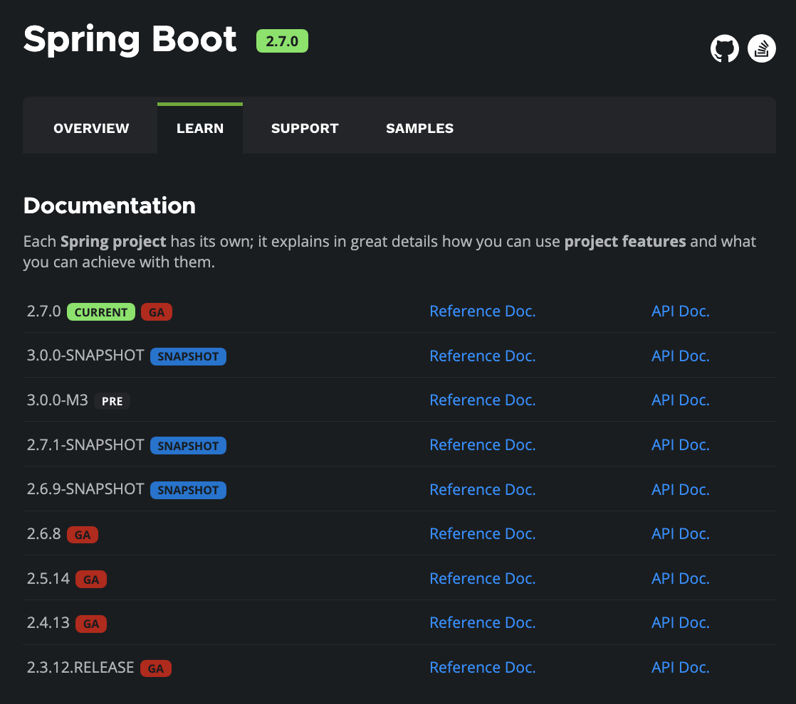
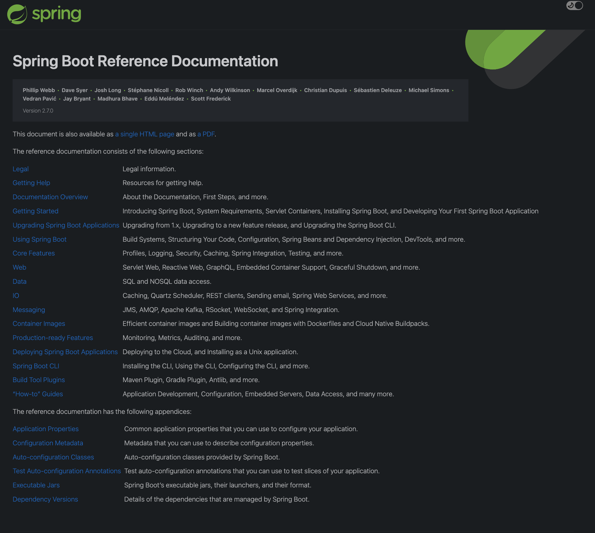
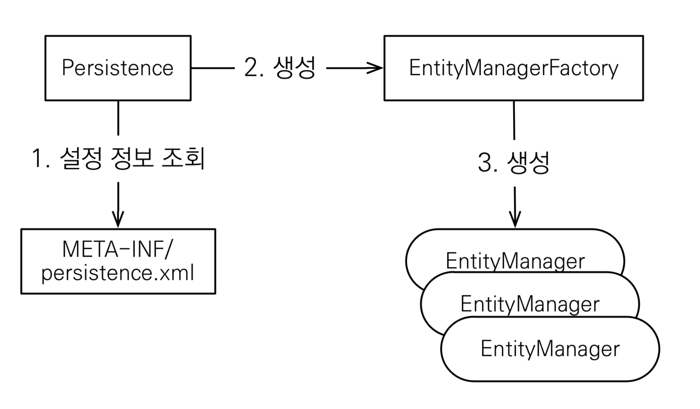
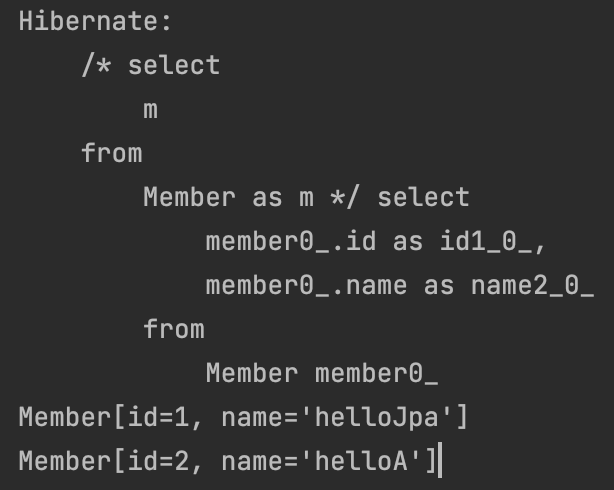
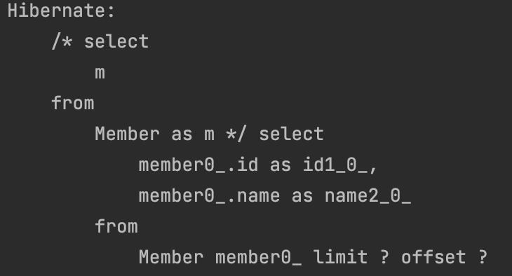

# JPA 시작하기

## Hello JPA 프로젝트 생성

- project

  - groupId: jpa-basic
  - artifactId: ex1-hello-jpa
  - version: 1.0.0

- pom.xml
  - hibernate
  - h2 database

```xml

<dependencies>
		<!-- JPA 하이버네이트 -->
		<dependency>
			<groupId>org.hibernate</groupId>
			<artifactId>hibernate-entitymanager</artifactId>
			<version>5.3.10.Final</version>
		</dependency>
		<!-- H2 데이터베이스 -->
		<dependency>
			<groupId>com.h2database</groupId>
			<artifactId>h2</artifactId>
			<version>1.4.199</version>
		</dependency>
	</dependencies>

```

- persistence.xml

```xml

<?xml version="1.0" encoding="UTF-8"?>
<persistence version="2.2"
             xmlns="http://xmlns.jcp.org/xml/ns/persistence" xmlns:xsi="http://www.w3.org/2001/XMLSchema-instance"
             xsi:schemaLocation="http://xmlns.jcp.org/xml/ns/persistence http://xmlns.jcp.org/xml/ns/persistence/persistence_2_2.xsd">
    <persistence-unit name="hello">
        <properties>
            <!-- 필수 속성 -->
            <property name="javax.persistence.jdbc.driver" value="org.h2.Driver"/>
            <property name="javax.persistence.jdbc.user" value="sa"/>
            <property name="javax.persistence.jdbc.password" value=""/>
            <property name="javax.persistence.jdbc.url" value="jdbc:h2:tcp://localhost/~/test"/>
            <property name="hibernate.dialect" value="org.hibernate.dialect.H2Dialect"/>
            <!-- 옵션 -->
            <property name="hibernate.show_sql" value="true"/>
            <property name="hibernate.format_sql" value="true"/>
            <property name="hibernate.use_sql_comments" value="true"/>
            <!--<property name="hibernate.hbm2ddl.auto" value="create" />-->
        </properties>
    </persistence-unit>
</persistence>

```

- JPA는 특정 데이터베이스에 종속 X
- 각각의 데이터베이스가 제공하는 sql 문법과 함수가 조금씩 다름
- 가변 문자
  - MySQL: VARCHAR
  - Oracle VARCHAR2
- 문자열을 자르는 함수
  - SQL 표준은 SUBSTRING()
  - Oracle은 SUBSTR()
- 페이징
  - MySQL은 LIMIT
  - Oracle은 ROWNUM

</br>

### 라이브러리 버전 선택 팁

| [1. Spring boot 2.7.0 reference doc](https://docs.spring.io/spring-boot/docs/current/reference/html/) |
| :---------------------------------------------------------------------------------------------------: |
|                                                   |

| [2. dependency version](https://docs.spring.io/spring-boot/docs/current/reference/html/) |
| :--------------------------------------------------------------------------------------: |
|                                   |

</br>

## Hello JPA - 애플리케이션 개발

|                    JPA 구동방식                     |
| :-------------------------------------------------: |
|  |

- Persistence에서 EntityManagerFactory 생성
- EntityManager를 트랜잭션 단위로 생성하여 사용

</br>

- 관련 메서드들

```java

  // 1. Persistence에서 emf 생성하기
  EntityManagerFactory emf = Persistence.createEntityManagerFactory("hello");

  // 2. EntityManger 생성
  EntityManager em = emf.createEntityManager();

  // 3. 트랜잭션 생성
  EntityTransaction tx = em.getTransaction();

  // 4. 트랜잭션 시작
  tx.begin();

  // 5. 저장
  em.persist(엔티티 클래스);

  // 6.조회

  em.persist(Member.class, 1L); // 클래스타입과 식별자

  // 7. update는 더티체킹
  // 8. 삭제
  em.remove(엔티티 클래스);

  // 5. 트랜잭션 커밋
  tx.commit();
```

- Warning
  - 엔티티 매니저 팩토리는 하나만 생성해서 애플리케이션 전체에서 공유
    - 싱글톤 관리
  - 엔티티 매니저는 쓰레드간에 공유 X(사용하고 버려야 한다.)
  - JPA의 모든 데이터 변경은 트랜잭션 안에서 실행
    - 트랜잭션 단위를 너무 크게 하면 장애 발생시 리스크가 커진다

### JPQL 소개

</br>

- 가장 단순한 조회 방법
  - EntityManager.find()
  - 객체 그래프 탐색(a.getB().getC())
- 나이가 18살 이상인 회원을 모두 검색하고 싶다면?

```java

List<Member> result = em.createQuery("select m from Member as m", Member.class)
                    .getResultList();

            result.forEach(System.out::println);

```

- jpa는 테이블을 대상으로 쿼리를 날리는게 아니라
- 객체를 대상으로 쿼리를 날림

|                   jpql result                   |
| :---------------------------------------------: |
|  |

</br>

- page

```java

List<Member> result = em.createQuery("select m from Member as m", Member.class)
                    .setFirstResult(5) // 5번부터
                    .setMaxResults(10) // 10개 가져와
                    .getResultList();

```

|                   jpql page                   |
| :-------------------------------------------: |
|  |

</br>

- 쿼리에 offset과 limit가 나가는 것을 확인할 수 있다.

#### JPQL 특성

- JPA를 사용하면 엔티티 객체를 중심으로 개발
- 문제는 검색 쿼리
- 검색을 할 때도 테이블이 아닌 엔티티 객체를 대상으로 검색
- 모든 DB 데이터를 객체로 변환해서 검색하는 것은 불가능
- 애플리케이션이 필요한 데이터만 DB에서 불러오려면 결국 검색 조건이 포함된 SQL이 필요

</br>

- JPA는 SQL을 추상화한 JPQL이라는 객체 지향 쿼리 언어 제공
- SQL 문법 유사, SELECT, FROM. WHERE, GROUP BY, HABING, JOIN 지원
- `JPQL은 엔티티 객체를 대상으로 쿼리`
- `SQL은 테이블을 대상으로 쿼리`

</br>
