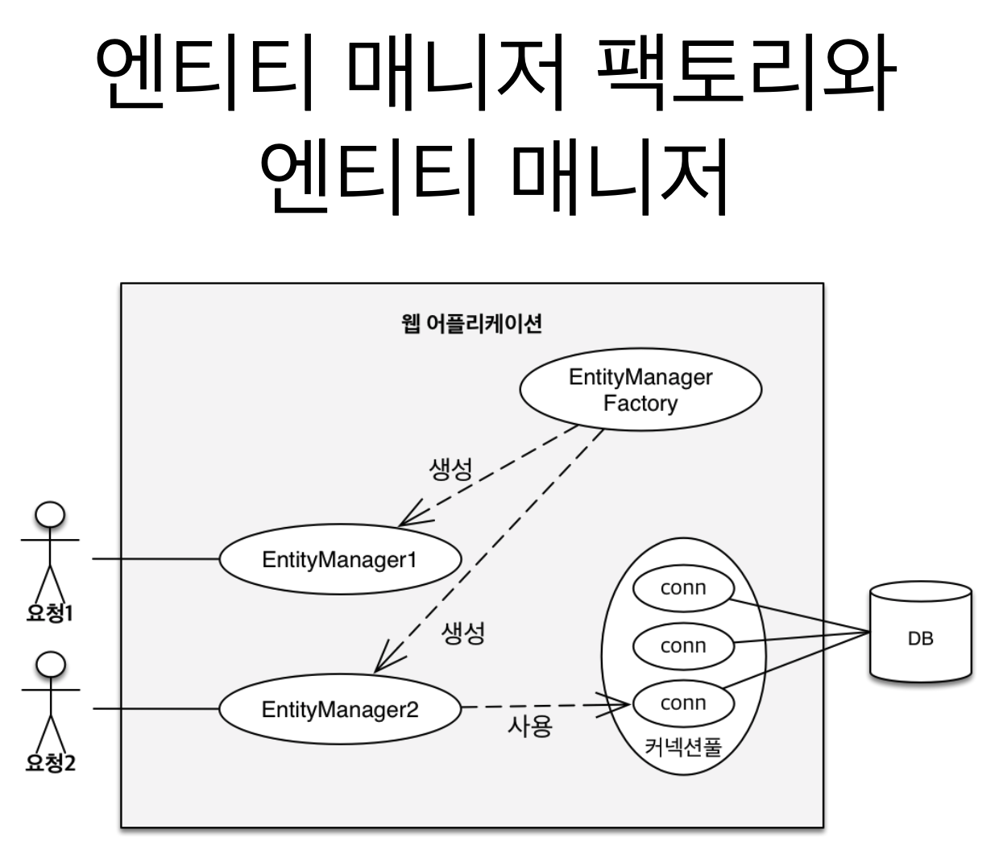
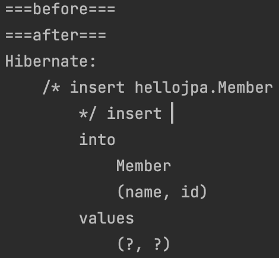
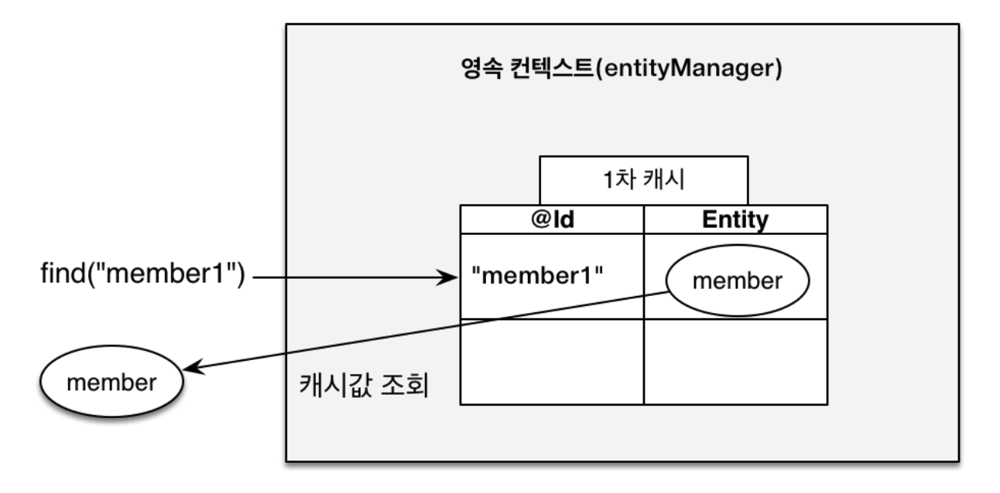
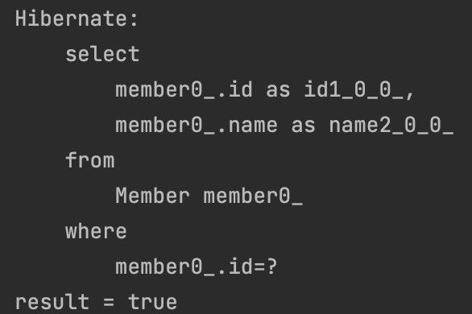
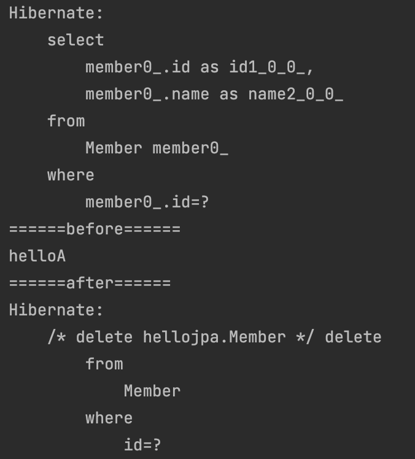
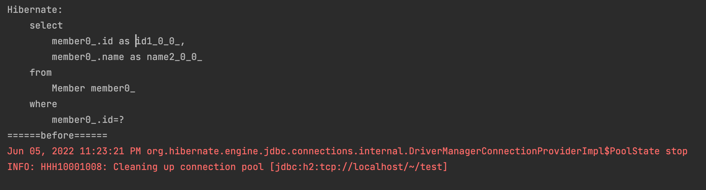

# 영속성 관리 - 내부 동작 방식

## 영속성 컨텍스트 1

|                   영속성 컨텍스트                    |
| :--------------------------------------------------: |
|  |

</br>

- 엔티티를 영구 저장하는 환경
- db에 저장하는 것이 아니라 영속성 컨텍스트에 일단 저장한다는 것

</br>

|                  생명주기                   |
| :-----------------------------------------: |
|  |

- 비영속
  -Jpa랑 전혀 관계없는 상태

- 영속
  - em.persist(member)
  - 이때 member 객체가 영속화 되었다고 말함

```java

 tx.begin();

        try{
            //비영속
            Member member = new Member();
            member.setId(3L);
            member.setName("hellocc");

            System.out.println("===before===");
            //영속화
            em.persist(member);
            System.out.println("===after===");

            tx.commit();// 실제 쿼리 날아가는 시점
        }catch (Exception e){
            tx.rollback();
        }

```

|                 쿼리 결과                  |
| :----------------------------------------: |
|  |

> em.persist를 통해 비영속 상태인 member를 영속성 컨텍스트에 저장하고  
> 실제 트랜잭션이 커밋되는 시점에 커넥션을 얻어서 db에 저장된다.  
> 그로인해 before와 after 사이에서 db 쿼리가 날아가는 것이 아님을 확인할 수 있다.

- 준영속
  - em.detach()
- 삭제
  - em.remove()

</br>

## 영속성 컨텍스트 2

- 1차 캐시

|                1차 캐시                 |
| :-------------------------------------: |
|  |

> 식별자(PK)와 Entity가 Map 형태로 저장되어 있음  
> 그래서 우선 조회할 때 1차캐시를 조회한다는 이점...  
> 그리고 조회했을때 1차캐시에 없다면 db에 연결하여 가져온 후  
> 그 이후부터는 1차캐시에서 조회한다.

- 동일성 보장

```java

tx.begin();

        try{
            //비영속
            Member findMember1 = em.find(Member.class, 1L);
            Member findMember2 = em.find(Member.class, 1L);

            System.out.println("result = " + (findMember1 == findMember2));

            tx.commit();// 실제 쿼리 날아가는 시점
        }catch (Exception e){
            tx.rollback();
        }

```

|               동일성 보장 결과               |
| :------------------------------------------: |
|  |

</br>

> 1차 캐시로 반복 가능한 읽기(REPEATABLE READ) 등급의 트랜잭션 격리 수준을  
> 데이터베이스가 아닌 애플리케이션 차원에서 제공

</br>

- 트랜잭션을 지원하는 쓰기 지연
  - 커밋하는 순간에 커넥션을 얻어서 쿼리를 날리는 동작 방식
  - transaction.commit() 시점에 flush() 연산 수행
  - 커넥션을 가져오고 반환하는 시간 소모를 줄일 수 있다.
  - 더 적은 커넥션으로 효율적인 운영가능

</br>

- 엔티티 변경 감지 - dirty checking
  - 영속성 컨텍스트에서 관리하는 엔티티 클래스의 변경을 감지한다.
  - 따라서 Spring data jpa에서 업데이트 할 경우는 findById를 통해 영속성 컨텍스트로 가져온 후
  - update나 set을 통해 스탭샷을 비교하여 트랜잭션 커밋하는 순간 update 쿼리가 날아간다.

</br>

## 플러시

</br>

- 변경 감지
- 수정된 엔티티 쓰기 지연 SQL 저장소에 등록
- 쓰기 지연 SQL 저장소의 쿼리를 데이터베이스에 전송
  - 등록, 수정, 삭제

</br>

- 영속성 컨텍스트를 플러시하는 방법
  - em.flush()
  - 트랜잭션 커밋 : 플러시 자동 호출
  - JPQL 쿼리 실행 :플러시 자동 호출
    - em.persist로 쓰기 지연 후에 쿼리가 안날아갈 경우
    - jpql에서 가져올 수 없음으로 기본적으로 날리는구나라고 이해하기.

</br>

```java
// 삭제 되는 케이스

try{
            // 1. select
            Member member = em.find(Member.class, 2L);

            System.out.println("======before======");

            // 2. 비영속 상태
            em.remove(member);

            // 3. 이름 조회
            System.out.println(member.getName());
            System.out.println("======after======");

            tx.commit();//4. 실제 쿼리 날아가는 시점
        }catch (Exception e){
            tx.rollback();
        }


```

|              삭제 되는 케이스              |
| :----------------------------------------: |
|  |

- 이름이 출력되는 이유는 member 객체가 비영속화 된 것이지 member 자체가 null이 되는 것이 아님.
- 추후 delete 쿼리가 날아가는 것을 확인

</br>

```java

//삭제 안되는 케이스

try{
            //비영속

            // 1. select
            Member member = em.find(Member.class, 3L);

            System.out.println("======before======");

            // 2. 비영속 상태
            em.remove(member);

            Member member2 = em.find(Member.class, 3L);

            // 3. 이름 조회
            System.out.println(member2.getName());
            System.out.println("======after======");

            tx.commit();//4. 실제 쿼리 날아가는 시점
        }catch (Exception e){
            tx.rollback();
        }

```

|                 삭제 안되는 케이스                 |
| :------------------------------------------------: |
|  |

- 의문점..
  - 1. select 쿼리가 날아오는 것을 확인 할 수 있다
  - 2. remove가 돼서 비영속 상태로 만들었다.
  - 3. 다시 find메서드를 호출하였다. 이때 이후 부터 아무것도 수행하지 않는다... (after 출력 X)

</br>

- 플러시는!
  - 영속성 컨텍스트를 비우지 않는다.
  - 영속성 컨텍스트의 변경 내용을 데이터베이스에 동기화
  - 트랜잭션이라는 작업단위가 중요 -> 커밋 직전에만 동기화 하면 된다

</br>

## 준영속 상태

</br>

- em.detach() : 특정 엔티티만 준영속 상태로 전환
- em.clear() : 영속성 컨텍스트 모두를 초기화
- em.close() : 영속성 컨텍스트를 종료
