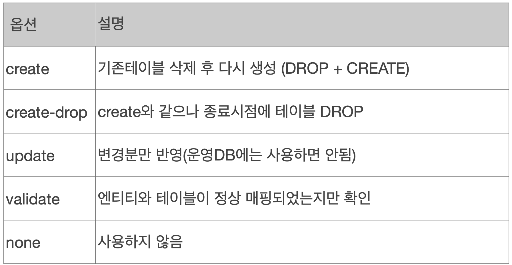
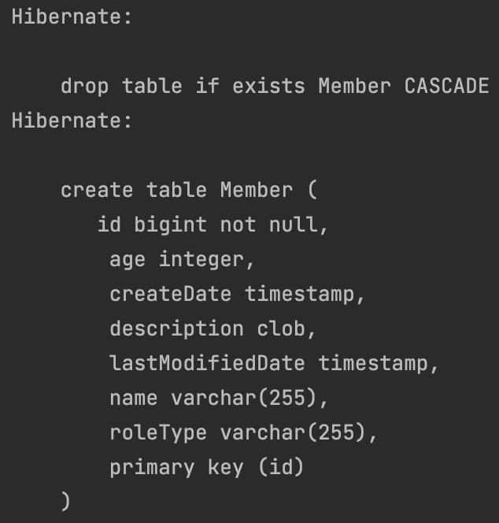
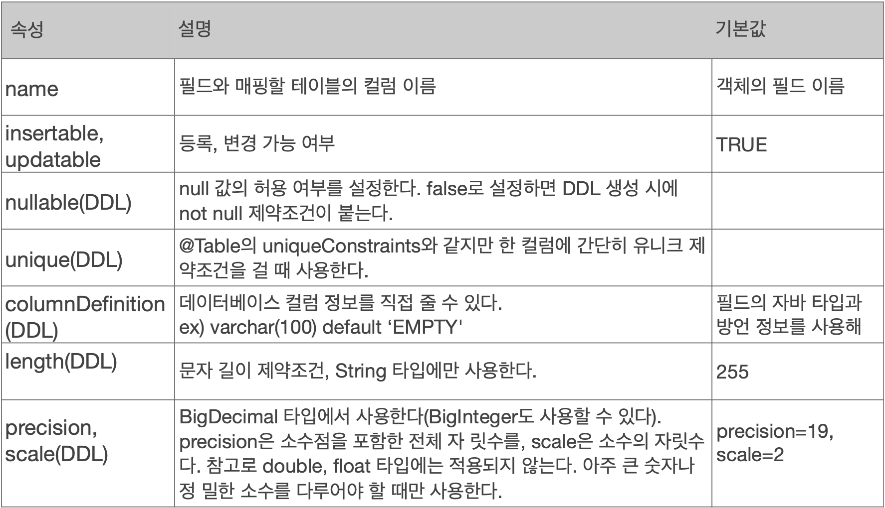
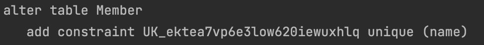
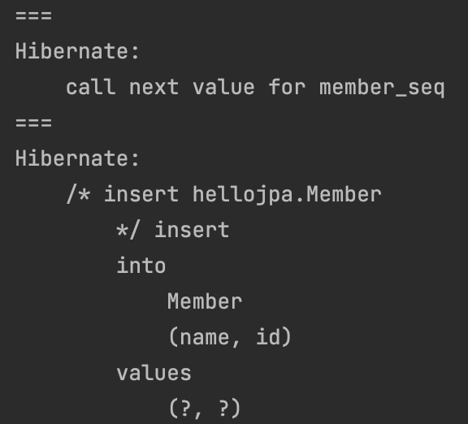
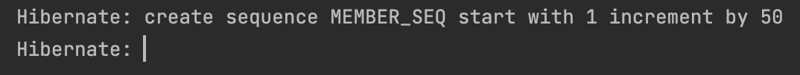
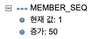
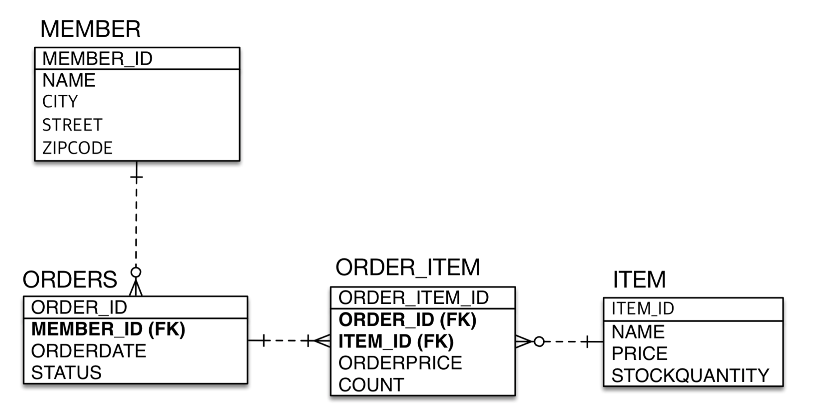

# 엔티티 매핑

</br>

## 객체와 테이블 매핑

</br>

- 객체와 테이블 매핑
  - @Entity
  - @Table
- 필드와 컬럼 매핑
  - @Column
  - @Id
- 연관관계 매핑
  - @ManyToOne
  - @JoinColumn

</br>

### @Entity

- JPA가 관리하는 클래스 엔티티
- JPA를 사용해서 테이블과 매핑할 클래스는 @Entity 필수
- `기본 생성자 필수`
  - public 또는 protected
  - reflection으로 동적으로 객체 정보를 알아낼때 기본생성자 요구
- final 클래스, enum, interface, inner 클래스 사용 x
- 저장할 필드에 final 사용 X
  - 왜냐하면 entity 클래스가 가변 객체
  - 영속성 컨텍스트에서 스냅샷을 찍어 더티 체킹하여 update 쿼리 날리기 때문

</br>

## 데이터베이스 스키마 자동 생성

- DDL을 애플리케이션 실행 시점에 자동 생성
- 테이블 중심 -> 객체 중심
- 데이터베이스 방언을 화용하여 데이터베이스에 맞는 적절한 DDL 생성
- 이렇게 생성된 DDL은 개발장비에서만 사용
- 생성된 DDL은 운영서버에서는 사용하지 않거나, 적절히 다듬은 후 사용

</br>

|         hibernate.hbm2.ddl.auto         |
| :-------------------------------------: |
|  |

</br>

- 개발 초기 단계에는 create 또는 update
- 테스트 서버는 update 또는 validate
- 스테지잉과 운영서버는 validate 또는 none

</br>

## 필드와 컬럼 매핑

- 요구사항
  - 회원은 일반회원과 관리자로 구분해야 한다,
  - 회원 가입일과 수정일이 있어야 한다.
  - 회원을 설명할 수 있는 필드가 있어야 한다. 길이제한 X

</br>

```java

@Entity
public class Member {

    @Id
    private Long id;

    private String name;

    @Enumerated(EnumType.STRING)
    RoleType roleType;

    private Integer age;

    @Temporal(TemporalType.TIMESTAMP)
    private Date createDate;

    @Temporal(TemporalType.TIMESTAMP)
    private Date lastModifiedDate;

    @Lob
    private String description;

    protected Member(){}

    //생략
}

```

|                DDL 쿼리 확인                |
| :-----------------------------------------: |
|  |

</br>

| 어노테이션  |                 설명                  |
| :---------: | :-----------------------------------: |
|   @Column   |               컬럼 매핑               |
|  @Temporal  |            날짜 타입 매핑             |
| @Enumerated |            enum 타입 매핑             |
|    @Lob     |            BLOB, CLOB 매핑            |
| @Transient  | 특정 필드를 컬럼에 매핑하지 않고 무시 |

</br>

- @Column

|     @Column option 자세히 살펴보기      |
| :-------------------------------------: |
|  |

</br>

|            @Column unique 속성 사용하면...             |
| :----------------------------------------------------: |
|  |

- 생성되는 유니크 키 이름이 랜덤하게 생성되어 보기 힘듦

</br>

- @Enumerated(default가 ORDINAL임으로 STRING으로 꼭 옵션 넣어주기)

  - EnumType.STRING : enum 이름을 저장
  - EnumType.ORDINAL : enum 순서를 데이터베이스에 저장
    - 사용 X 되는 옵션
    - 이전 데이터와 순서가 섞이는 문제가 발생 -> 정확성 보장 X

- @Temporal

  - 날짜 타입(java.util.Date, java.util.Calendar)을 매핑할 때 사용
  - LocalDate, LocalDateTime을 사용 할 때는 생략 가능(최신 하이버네이트 지원)
  - value
    - TemporalType.DATE: 날짜, 데이터베이스 date 타입과 매핑
    - TemporalType.TIME: 시간, 데이터베이스 time 타입과 매핑
    - TemporalType.TIMESTAMP: 날짜와 시간, 데이터베이스 timestamp 타입과 매핑

- @Lob
  - 지정할 수 있는 속성이 없다
  - 매핑하는 타입이 문자면 CLOB 매핑 나머지는 BLOB 매핑
    - CLOB: String, char[], java.sql.CLOB
    - BLOB: byte[], java.sql.BLOB

</br>

## 기본 키 매핑

</br>

- @Id

- @GeneratedValue
  - IDENTITY : MySQL
  - SEQUENCE : Oracle
  - AUTO : 방언에 따라 자동 지정

</br>

- IDENTITY 전략 - 특징
  - 기본 키 생성을 데이터베이스에 위임
  - 주로 MySQL, PostgreSQL, SQL Server에서 이용
    - MySQL의 AUTO_INCREMENT
  - JPA는 보통 트랜잭션 커밋 시점에 INSERT SQL 실행
  - `AUTO_INCREMENT는 데이터베이스에 INSERT SQL을 실행한 이후에 ID값을 알 수 있다.`
    - em.persist() 시점에 insert 쿼리가 날아간다.(PK를 알 수 없음으로)
    - 그리고 데이터베이스가 생성한 키 값을 영속성 컨텍스트가 가진다.
      - 그러면 select 쿼리가 실행되는 것이 아닌가?
        - jdbc 드라이버내에서 insert를 날렸을 때 이경우 내부적으로 pk값을 return 되는 로직이 수행된다.
    - `따라서 이 경우 insert 시 쓰기지연 저장소의 장점이 사라진다`

</br>

- SEQUENCE 전략 - 특징
  - 데이터베이스 시퀀스는 유일한 값을 순서대로 생성하는 특별한 데이터베이스 오브젝트
    - Oracle sequence
  - Oracle, PostgreSQL, DB2, H2 데이터베이스에서 사용

</br>

|                  sequence                  |
| :----------------------------------------: |
|  |

> em.persist() 시점에서 member_seq 객체를 불러온다.  
> 불러온 member_seq를 통해 pk를 결정하고,  
> 그 후 트랜잭션이 커밋될 때 insert 쿼리가 날아간다.

</br>

|               generator option 없으면               |
| :-------------------------------------------------: |
|  |

</br>

```java

    @Id
    @GeneratedValue(strategy = GenerationType.SEQUENCE, generator = "member_seq")
    private Long id;

```

</br>

|                 generator option                 |
| :----------------------------------------------: |
|  |

</br>

> 이렇게 원하는 sequence로 생성 가능!!

</br>

### @Id 전략은 결국 DB를 타야하는데 성능은?

</br>

- 매번 persist할 때마다 pk를 지정하기 위해 db에 지원을 받는 것은 성능이 떨어진다.

```java
@SequenceGenerator(
        name = "MEMBER_SEQ_GENERATOR",
        sequenceName = "MEMBER_SEQ", //매핑할 데이터베이스 시퀀스 이름
        initialValue = 1, allocationSize = 50)
```

|                          console                          |
| :-------------------------------------------------------: |
|        |
|  |

</br>

- 동시성 문제 없이 해결해준다.
- allocationSize는 시퀀스 한 번 호출에 증가하는 수

</br>

- @TableGenerator
  - 키 생성 전용 테이블을 하나 만들어서 데이터베이스 시퀀스를 흉내내는 전략
  - 장점 : 모든 데이터베이스에 적용 가능
  - 단점 : 성능

```java

@Entity
@TableGenerator(
name = "MEMBER_SEQ_GENERATOR",
table = "MY_SEQUENCES",
pkColumnValue = “MEMBER_SEQ", allocationSize = 1)
public class Member {
    @Id
    @GeneratedValue(strategy = GenerationType.TABLE, generator = "MEMBER_SEQ_GENERATOR")
    private Long id;
}

```

> 운영에서 쓰기에는 부담스럽다.  
> 테이블을 하나 만들어서 쓸 경우 락도 걸릴 수 있고...

</br>

### 권장하는 식별자 전략

</br>

- 기본키 제약 조건: null 아님, 유일성, 불변성
- 미래까지 이 조건을 만족하는 자연키는 찾기 어렵다.
  - `대리키를 사용!`
- 예를 들어 주민등록번호도 기본키로 적절하지 않다.
  - 이 경우 외래키로 곧곧에 퍼져있는데 어떻게..?
- `권장: Long + 대체키 + 키 생성 전략 사용`
  - 근데 그냥 자연키를 찾아서 쓸 수 있다면 그것이 베스트가 아닐까...
    - 주의하긴 해야겠다.. 곧곧에 퍼져있는 테이블까지 변경은 좀...
    - 비즈니스를 키로 끌고 오는 것은 바람직하지 않다.

</br>

## 실전 예제 1 - 요구사항 분석과 기본 매핑

</br>

- 회원과 주문의 관계
  - 1:N
- 주문과 상품의 관계
  - 주문할 때 여러 상품을 선택할 수 있다.
  - 반대로 같은 상품도 여러번 주문 될 수 있음으로 주문상품이라는 모델을 만들어서 다대다 관계를 일대다, 다대일 관계로 풀어냄

</br>

|                테이블 설계                 |
| :----------------------------------------: |
|  |

</br>
