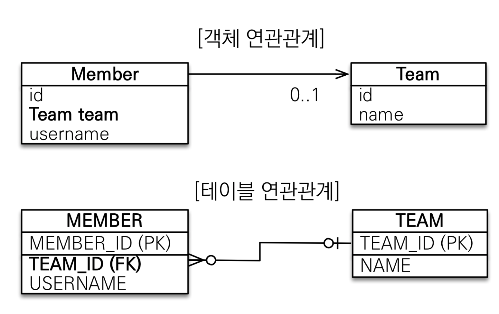
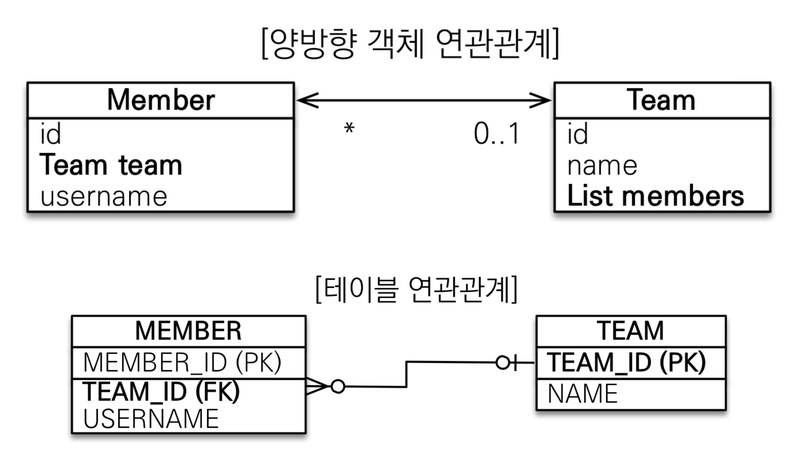
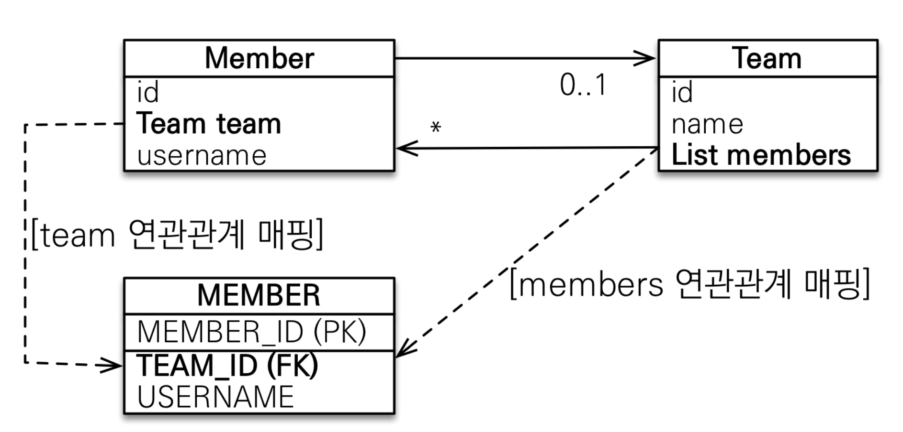
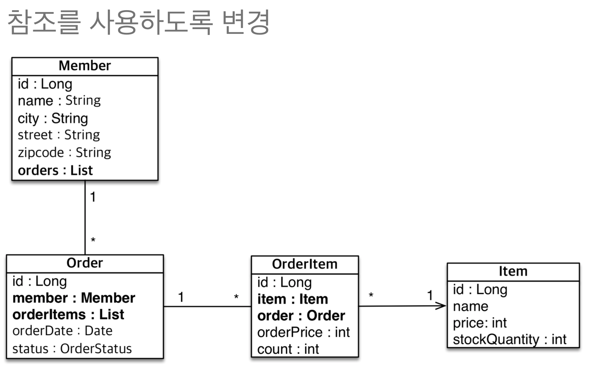

# 연관관계 매핑 기초

</br>

## 단방향 연관관계

</br>

|                객체 연관간계 사용                |
| :----------------------------------------------: |
|  |

</br>

- 테이블은 외래 키로 조인을 사용해서 연관된 테이블을 찾는다.
- `객체는 참조를 사용`해서 연관된 객체를 찾는다.

</br>

```java
@Entity
public class Team {

    @Id
    @GeneratedValue
    @Column(name = "TEAM_ID")
    private Long id;

    private String name;

    //생략
}
```

```java

@Entity
public class Member {

    @Id
    @GeneratedValue
    @Column(name = "MEMBER_ID")
    private Long id;

    @Column(name = "USER_NAME")
    private String name;

    @ManyToOne(fetch = FetchType.LAZY)
    @JoinColumn(name = "TEAM_ID", referencedColumnName = "TEAM_ID")
    private Team team;

    //생략
}
```

</br>

- 내가 짠거.
  - 수업 들으면서 확인해보자.
  - 일단은 잘알고 했다~

</br>

## 양방향 연관관계와 연관관계의 주인 1 - 기본

</br>

|                  양방향 매핑                   |
| :--------------------------------------------: |
|  |

</br>

- 테이블은 외래키로 양쪽의 정보를 다 알 수 있다.
- 하지만 Team에 List가 없다면 찾아낼 수 없다...
  - 추후 lazy loading 연관

</br>

```java
@Entity
public class Team {

    @Id
    @GeneratedValue
    @Column(name = "TEAM_ID")
    private Long id;

    private String name;

    @OneToMany(mappedBy = "team")
    private List<Member> members = new ArrayList<>();

    //생략
}
```

- mappedBy로 주인 설정
  - 주인은 외래키를 가진 객체가 되어야 함.

```java

@Entity
public class Member {

    @Id
    @GeneratedValue
    @Column(name = "MEMBER_ID")
    private Long id;

    @Column(name = "USER_NAME")
    private String name;

    @ManyToOne(fetch = FetchType.LAZY)
    @JoinColumn(name = "TEAM_ID", referencedColumnName = "TEAM_ID")
    private Team team;

    //생략
}
```

</br>

- 객체와 테이블이 관계를 맺는 차이
  - 테이블은 외래키 하나만으로 양방향이 되지만
  - `객체는 단방향 두 개를 맺어 양방향으로 만들어줘야한다.`
    - 서로가 서로를 가져야해...

</br>

- 둘 중 하나로 외래 키를 관리 해야 한다.

|             연관 관계 매핑              |
| :-------------------------------------: |
|  |

</br>

- 한 쪽에만 값이 들어간다면 데이터의 정합성 보장 X

</br>

### 연관관계의 주인

</br>

- 양방향 매핑 규칙
  - 객체이ㅡ 두 관계중 하나를 연관관계의 주인으로 지정
  - `연관관계의 주인만이 외래 키를 관리(등록, 수정)`
  - `주인이 아닌쪽은 읽기만 가능`
  - 주인은 mappedBy 속성 사용 X
  - 주인이 아니면 `mappedBy 속성으로 주인 지정`
    - 쉽게 `@OneToMany를 가지는 객체에 해줘야한다아 이거야...`

</br>

## 양방향 연관관계와 연관관계의 주인 2 - 주의점, 정리

</br>

### 많이 하는 실수

```java

Team team = new Team();
team.setName("TeamA");
em.persist(team);

Member member = new Member();
member.setName("member1");


//역방향(주인이 아닌 방향)만 연관관계 설정
team.getMembers().add(member);
em.persist(member);

```

- 이 경우 연관관계의 주인인 member에서 외래키를 안 넣어준 격
- Team에서 추가할때 실수 안하도록 로직을 추가하거나,
- 아니면 의무적으로 주인에서 추가해주거나.

</br>

- `순수 객체 상태를 고려해서 항상 양쪽에 값을 설정하자`
- 연관 관계 편의 메서드를 생성하자
- 양방향 매핑시에 무한 루프를 조심하자
  - toString()
  - lombok
  - JSON 생성 라이브러리

</br>

> 양방향 매핑시에 무한 루프란...
> 가져오는 연관관계 객체가 프록시 객체일 경우
> 값이 없기 때문에 toString, JSON 객체시 불러오는 경우 문제 발생 가능

</br>

> 영한님은 setter 관례를 피하기 위해 change 네이밍을 쓰시는구나..

</br>

### 양방향 매핑 정리

</br>

- 단방향 매핑만으로도 이미 연관관계 매핑은 완료
- 양방향 매핑은 반대 방향으로 조회 기능이 추가된 것
- JPQL에서 역방향으로 탐색할 일이 많다.
- 단방향 매핑을 잘 하고 양방향은 필요할 때 추가해도 된다.
  - 테이블에 영향을 주지 않는다.

</br>

## 실전 예제 2 - 연관관계 매핑 시작

</br>

|                 올바른 매핑                  |
| :------------------------------------------: |
|  |

```java

@Entity
public class Member {

    @Id
    @GeneratedValue(strategy = GenerationType.AUTO)
    @Column(name = "MEMBER_ID")
    private Long id;

    private String name;

    private String city;

    private String street;

    private String zipCode;

    @OneToMany(mappedBy = "member")
    private List<Order> orders = new ArrayList<>();
}

```

</br>

```java
@Entity
@Table(name = "ORDERS")
public class Order {

    @Id
    @GeneratedValue(strategy = GenerationType.AUTO)
    @Column(name = "ORDER_ID")
    private Long id;

    private LocalDateTime orderDate;

    @Enumerated(EnumType.STRING)
    private OrderStatus status;

    @ManyToOne(fetch = FetchType.LAZY)
    @JoinColumn(name = "MEMBER_ID", referencedColumnName = "MEMBER_ID")
    private Member member;

}
```

</br>

```java

@Entity
public class OrderItem {

    @Id
    @GeneratedValue(strategy = GenerationType.AUTO)
    @Column(name = "ORDER_ITEM_ID")
    private Long id;

    private int orderPrice;

    private int count;

    @ManyToOne(fetch = FetchType.LAZY)
    @JoinColumn(name = "ORDER_ID", referencedColumnName = "ORDER_ID")
    private Order order;

    @ManyToOne(fetch = FetchType.LAZY)
    @JoinColumn(name ="ITEM_ID", referencedColumnName = "ITEM_ID")
    private Item item;

}
```

</br>

```java

@Entity
public class Item {

    @Id
    @GeneratedValue(strategy = GenerationType.AUTO)
    @Column(name = "ITEM_ID")
    private Long id;

    private String name;

    private int price;

    private int stockQuantity;

```

</br>
