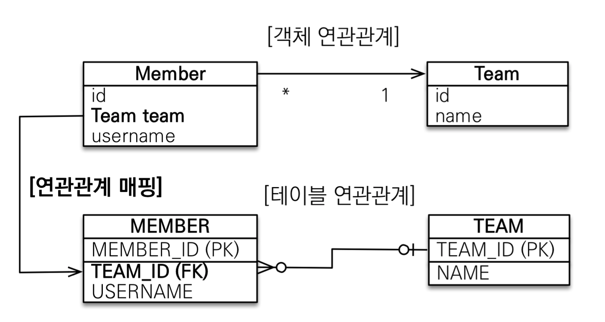
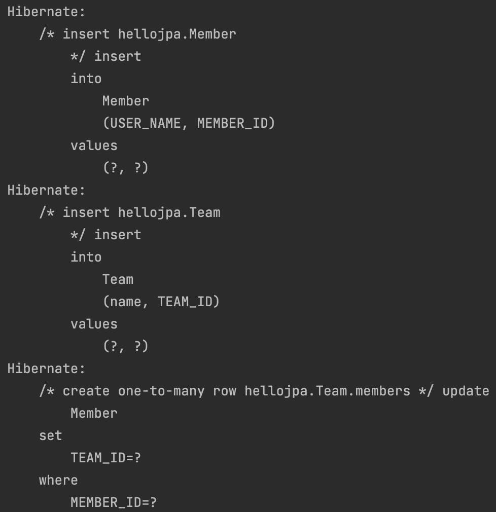
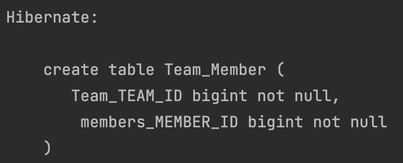
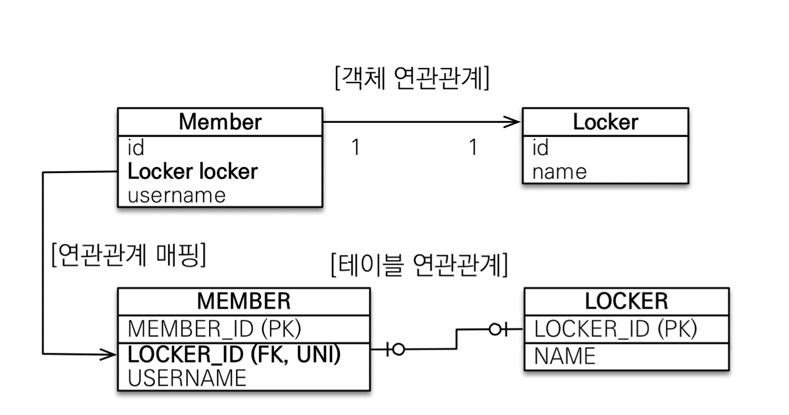
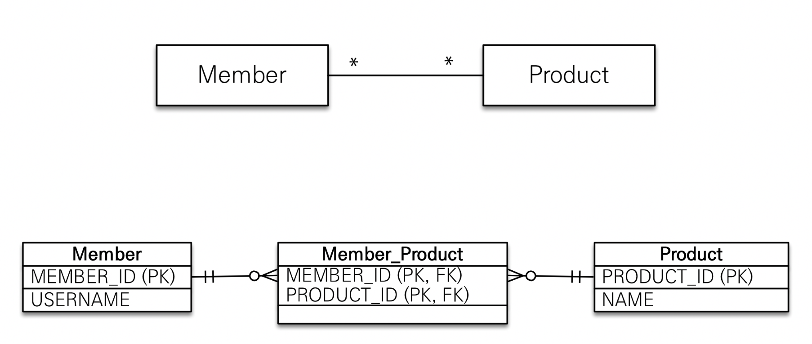
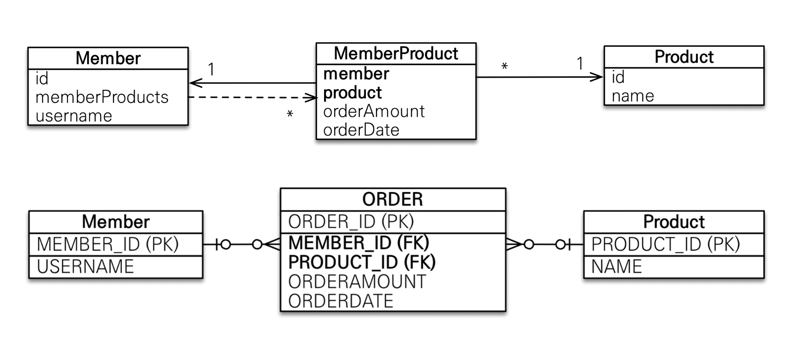
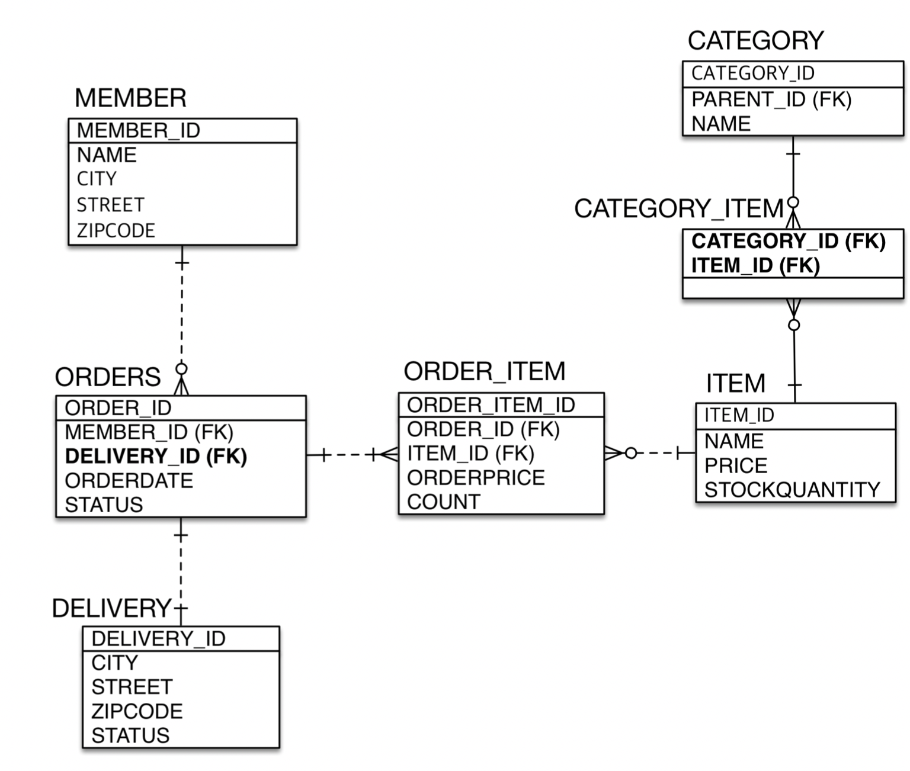

# 다양한 연관관계 매핑

</br>

- 연관관계 매핑시 고려사항 3가지
  - 다중성
  - 단방향, 양방향
  - 연관관계의 주인

</br>

- 연관관계의 주인: 외래 키를 관리하는 참조
- 주인의 반대편: 외래 키에 영향을 주지 않음, 단순 조회만

</br>

## 다대일 N:1

</br>

|                     N:1                      |
| :------------------------------------------: |
|  |

</br>

> DB에서는 N쪽에 외래키가 들어가는 것이 맞고,  
> N쪽에서 외래키를 가져야한다.

</br>

## 일대다 1:N

</br>

|                     N:1                      |
| :------------------------------------------: |
|  |

</br>

```java

@Entity
public class Team {

    @Id
    @GeneratedValue
    @Column(name = "TEAM_ID")
    private Long id;

    private String name;

    @OneToMany
    @JoinColumn(name = "TEAM_ID")
    private List<Member> members = new ArrayList<>();

}
```

```java

@Entity
public class Member {

    @Id
    @GeneratedValue
    @Column(name = "MEMBER_ID")
    private Long id;

    @Column(name = "USER_NAME")
    private String name;
}
```

</br>

- 일대다 단방향은 1:N에서 1이 연관관계의 주인
- 하지만, 테이블 일대다 관계는 항상 N쪽에 외래 키가 존재
- `외래키를 가지지 않는 객체 테이블에서 외래키를 관리하는 구조`
- @JoinColumn을 꼭 사용해야함 그렇지 않으면 조인 테이블 방식?

</br>

```java

tx.begin();

        try{

            Member member1 = new Member("jung");

            em.persist(member1);

            Team team = new Team("teamA");
            team.getMembers().add(member1);

            em.persist(team);

            tx.commit();//4. 실제 쿼리 날아가는 시점
        }catch (Exception e){
            tx.rollback();
        }

```

|         update 쿼리가 추가적으로 날아감         |
| :---------------------------------------------: |
|  |

</br>

> 코드를 보면 member가 영속성 컨텍스트에 들어간다.(외래키가 null인 상태)
> 이후 team이 영석송 컨텍스트에 들어가고 연관관계를 맺음으로써  
> 추가적으로 update 쿼리가 날아간다.

</br>

|               @JoinColumn 안사용하면               |
| :------------------------------------------------: |
|  |

</br>

- 못보던 join table이 생긴다..
  - 장단점이 있다는데..?

</br>

- 1:N @OneToMany는 너무 어색하다...
  - 나는 team만 건들였는데 member에 왜 update가?
  - 실제 운영 테이블이 많아진다면 이해하기 힘들어진다.

</br>

- 단점
  - 엔티티가 관리하는 외래키가 다른 테이블에 있다
  - 연관 관계 관리를 위해 update sql이 실행 된다.
  - 차라리 손해를 보더라도 양방향으로 매핑하는 것이 맞다...

</br>

### 일대다 양방향 정리

- @JoinColumn(insertable = false, updatable=false)
- 읽기 전용필드를 사용해서 양방향처럼 사용하는 방법
- 다대일 양방향을 사용해라!

</br>

```java
@ManyToOne
    @JoinColumn(insertable = false, updatable = false)
    private Team team;

```

</br>

## 일대일 1:1

</br>

- 일대일 관계는 그 반대도 일대일
- 주 테이블이나 대상 테이블 중에 외래 키 선택 가능
  - 주 테이블에 외래 키
  - 대상 테이블에 외래 키
- 외래 키에 데이터베이스 유니크 제약 조건 추가

</br>

|             1:1 주테이블에 외래키 단방향              |
| :---------------------------------------------------: |
|  |

</br>

- Member에 LOCKER_ID를 FK로 두고, 유니크 제약 조건을 둔다.
  - 그 반대도 허용한다.
- 다대일 단방향 매핑과 유사
- 양방향으로 하면 반대쪽도 `@OneToOne 걸고 mappedBy만 주인 세팅`

</br>

```java

@Entity
public class Member {

    @Id
    @GeneratedValue
    @Column(name = "MEMBER_ID")
    private Long id;

    @Column(name = "USER_NAME")
    private String name;

    @OneToOne
    @JoinColumn(name = "LOCKER_ID")
    private Locker locker;

    //생략
}

```

</br>

> 내가 DBA라 하면 시간이 흘렀을때...  
> 하나의 회원이 여러개의 Locker를 가진다면...?  
> MEMBER가 외래키를 갖는게 적합하지 않다.
>
> 반대로 하나의 라커가 여러개의 회원을 가질때...?
> LOCKER가 외래키를 갖는게 적합하지 않다..

</br>

- MEMBER가 라커를 들고 있는게 성능상은 좋다.
  - 조인도 필요없이 멤버를 가지고 오는 순간 Locker를 갖고 있기 때문

</br>

### 일대일 정리

</br>

- 주 테이블에 외래 키
  - 주 객체가 대상 객체의 참조를 가지는 것처럼 주 테이블에 외래 키를 두고 대상 테이블을 찾음
  - 객체지향 개발자가 선호
  - JPA 매핑 관리 방식
  - 장점 : 주 테이블만 조회해도 대상 테이블에 데이터가 있는지 확인 가능
  - 단점 : 값이 없으면 외래키에 null을 허용 해야함

</br>

- 대상 테이블에 외래 키
  - 전통적인 데이터베이스 개발자 선호
  - 장점: 주 테이블과 대상 테이블을 `일대일에서 일대다 관계로 변경할때 테이블 구조 유지`
  - 단점: `프록시 기능의 한계로 지연 로딩으로 설정해도 항상 즉시 로딩됨`

</br>

## 다대다 N:M (사용 X)

</br>

|                 N:M                 |
| :---------------------------------: |
|  |

</br>

- 관계형 데이터베이스는 정규화된 `테이블 2개로 다대다 관계를 표현할 수 없음`
- 연결 테이블을 추가해서 일대다, 다대일 관계로 풀어내야 한다.
- 객체는 컬렉션을 사용해서 `객체 2개로 다대다 관계 가능`

</br>

- @ManyToMany 사용
- @JoinTable로 연결 테이블 지정
- 다대다 매핑: 단방향, 양방향 가능

</br>

|                    N:M                     |
| :----------------------------------------: |
|  |

</br>

> 영한님은 대리키를 pk로 사용하고  
> fk를 pk로 사용하지 않으신다..

</br>

</br>

## 실전 예제 3 - 다양한 연관관계 매핑

</br>

|                  예제                  |
| :------------------------------------: |
|  |

</br>

```java

@Entity
@Table(name = "ORDERS")
public class Order {

    @Id
    @GeneratedValue(strategy = GenerationType.AUTO)
    @Column(name = "ORDER_ID")
    private Long id;

    private LocalDateTime orderDate;

    @Enumerated(EnumType.STRING)
    private OrderStatus status;

    @ManyToOne(fetch = FetchType.LAZY)
    @JoinColumn(name = "MEMBER_ID", referencedColumnName = "MEMBER_ID")
    private Member member;

    @OneToOne
    @JoinColumn(name = "DELIVERY_ID")
    private Delivery delivery;
    }


```

```java

@Entity
public class Delivery {

    @Id
    @GeneratedValue
    private Long Id;

    private String city;

    private String street;

    private String zipcode;

    @Enumerated(EnumType.STRING)
    private DeliveryStatus deliveryStatus;

    @OneToOne(mappedBy = "delivery")
    private Order order;

}
```

```java

@Entity
public class Item {

    @Id
    @GeneratedValue(strategy = GenerationType.AUTO)
    @Column(name = "ITEM_ID")
    private Long id;

    private String name;

    private int price;

    private int stockQuantity;

    @ManyToMany(mappedBy = "items")
    private List<Category> categories = new ArrayList<>();

}
```

```java

@Entity
public class Category {

    @Id
    @GeneratedValue
    private Long id;

    private String name;

    @ManyToOne
    @JoinColumn(name = "PARENT_ID")
    private Category parent;

    @OneToMany(mappedBy = "parent")
    private List<Category> child = new ArrayList<>();

    @ManyToMany
    @JoinTable(name = "CATEGORY_ITEM",
        joinColumns = @JoinColumn(name = "CATEGORY_ID"),
            inverseJoinColumns = @JoinColumn(name = "ITEM_ID")
    )
    private List<Item> items = new ArrayList<>();
}

```

</br>

- @JoinColumn

  - name : 매핑할 외래 키 이름
  - referencedColumnName : 외래키가 참조하는 대상 테이블의 컬럼명
  - foreignKey(DDL) : 외래키 제약 조건을 직접 지정
  - unique, nullable, insertable, updatable, columnDefinition, table

- @ManyToOne
  - optional : false로 설정하면 연관된 엔티티가 항상 있어야함
  - fetch : 글로벌 페치 전략 설정
  - casacade: 영속성 전이
  - targetEntity: 연관된 엔티티의 타입 정보를 설정
