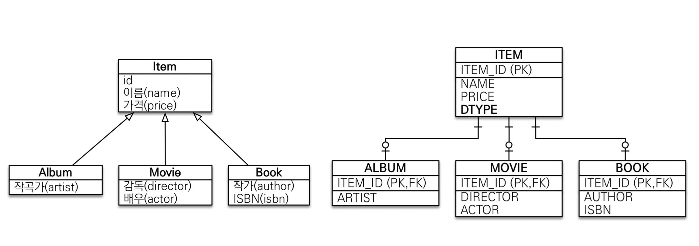
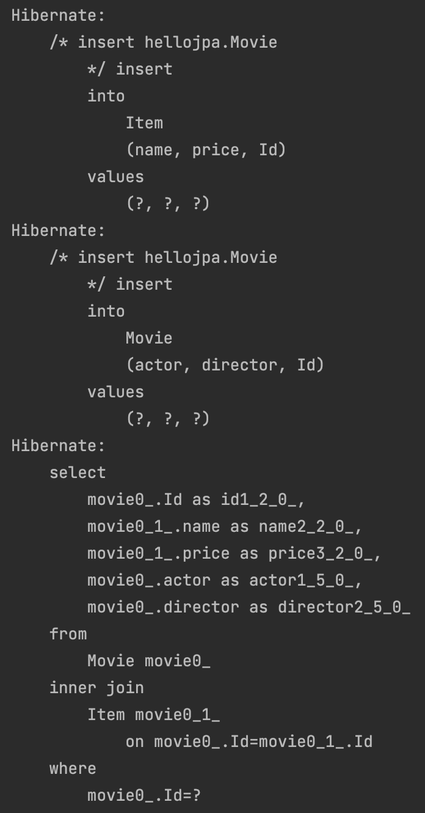
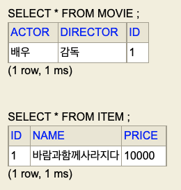
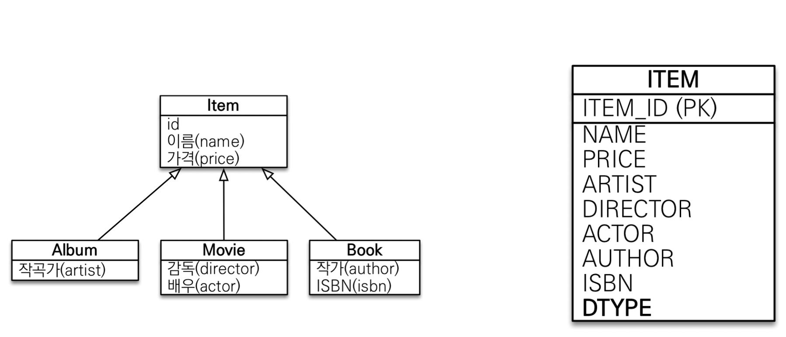
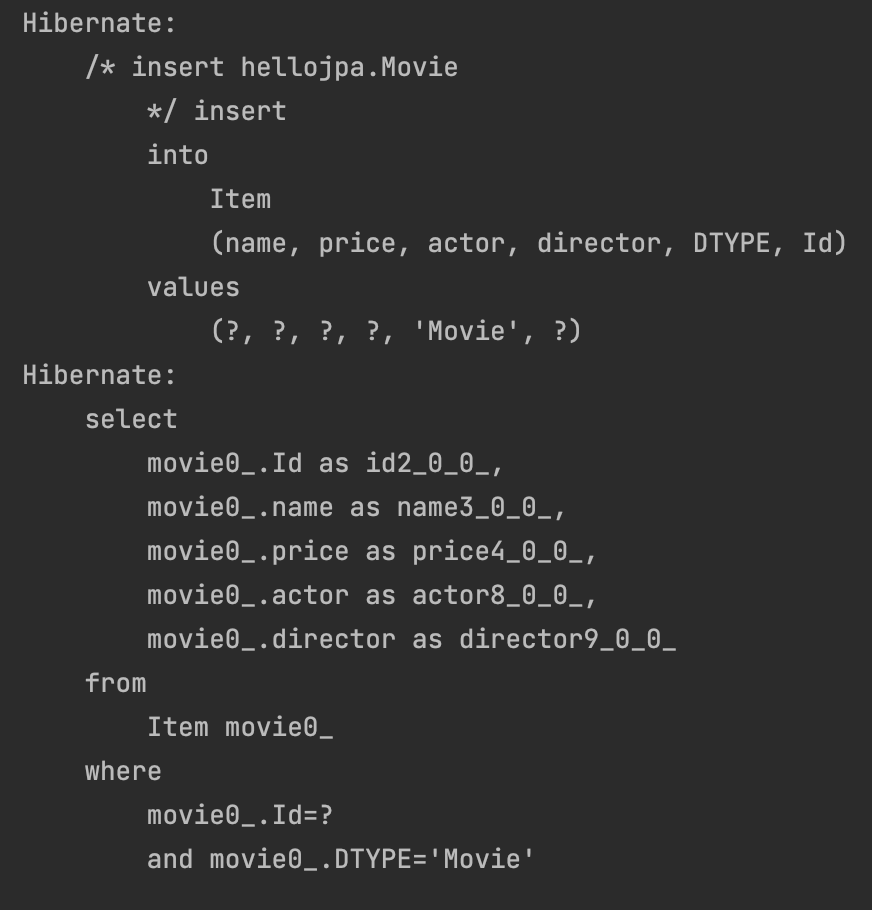
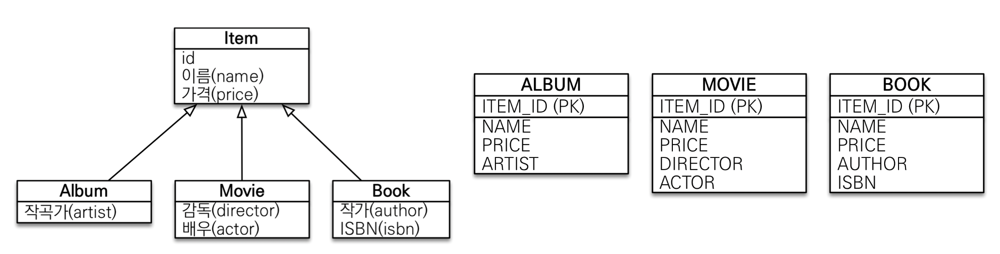
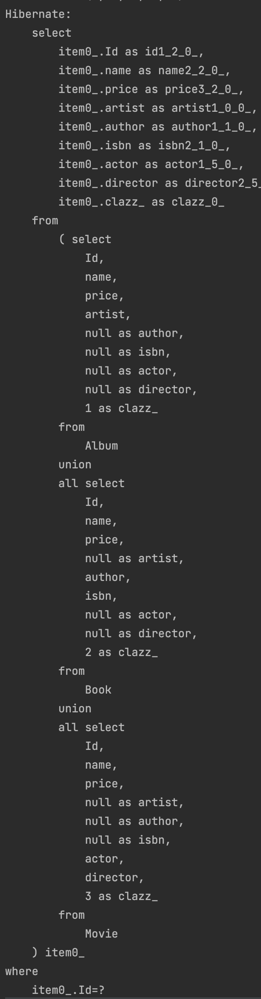
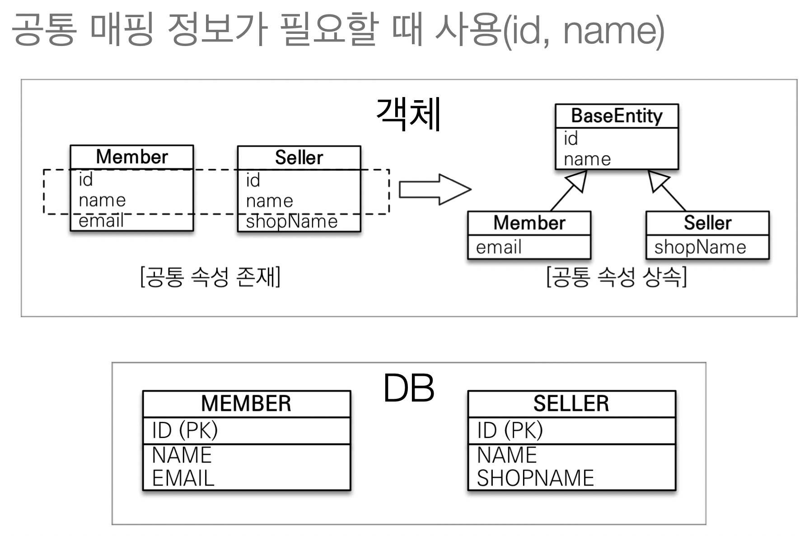
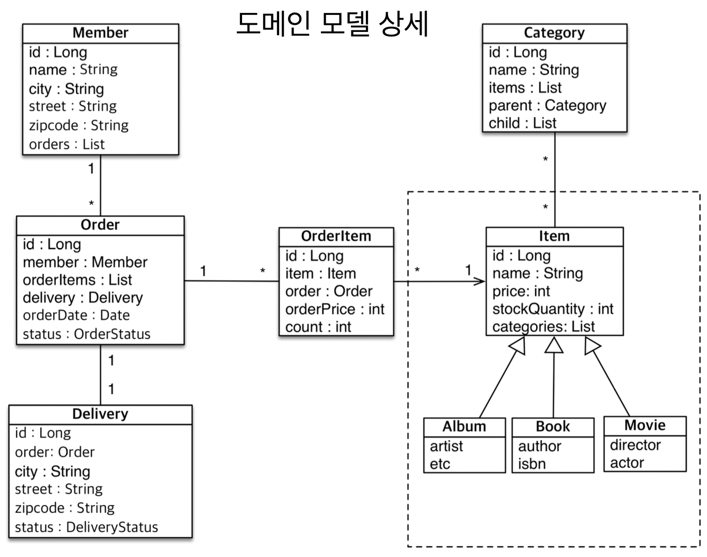

# 고급 매핑

</br>

## 상속관계 매핑

</br>

- 관계형 데이터베이스는 상속 관계 X
- 슈퍼타입 서브타입 관계라는 모델링 기법이 객체 상속과 유사
- 상속관계 매핑: 객체의 상속 구조와 DB의 슈퍼타입 서브타입 관계를 매핑

</br>

- 슈퍼타입 서브타입 논리 모델을 실제 물리 모델로 구현하는 방법
  - 조인 전략 : 각각 테이블로 변환
  - 단일 테이블 전략 : 통합테이블로 변환
  - 구현 클래스마다 테이블 전략 : 서브타입 테이블로 변환

</br>

|                조인 전략                |
| :-------------------------------------: |
|  |

</br>

> Item을 만들고 나머지 테이블을 구성  
> insert는 item과 album을 두 개 날리고  
> pk로 조인해서 데이터를 가져오는 전략  
> DType으로 식별

</br>

```java

@Entity
@Inheritance(strategy = InheritanceType.JOINED)
public abstract class Item {

    @Id
    @GeneratedValue
    private Long Id;

    private String name;

    private int price;

    protected Item(){}

    public Item(String name, int price) {
        this.name = name;
        this.price = price;
    }

    //생략
}

```

</br>

```java

@Entity
public class Album extends Item{

    private String artist;

    protected Album(){}

    public Album(String name, int price, String artist) {
        super(name, price);
        this.artist = artist;
    }
}

```

</br>

```java

@Entity
public class Movie extends Item{

    private String director;
    private String actor;

    protected Movie(){}

    public Movie(String name, int price, String director, String actor) {
        super(name, price);
        this.director = director;
        this.actor = actor;
    }
}

```

</br>

```java

@Entity
public class Book extends Item{

    private String author;
    private String isbn;

    protected Book(){}

    public Book(String name, int price, String author, String isbn) {
        super(name, price);
        this.author = author;
        this.isbn = isbn;
    }
}

```

</br>

- 실행 코드

```java

 tx.begin();

        try{
            Movie movie = new Movie("바람과함께사라지다", 10000, "감독","배우");

            em.persist(movie);

            em.flush();
            em.clear();

            em.find(Movie.class, movie.getId());

            tx.commit();//4. 실제 쿼리 날아가는 시점
        }catch (Exception e){
            tx.rollback();
        }

```

- 실행 코드 결과

|                    콘솔                    |
| :----------------------------------------: |
|  |

</br>

|                 h2 콘솔                  |
| :--------------------------------------: |
|  |

</br>

- @DiscriminatorColumn
  - 운영상에서 Item만 보고도 확인할 수 있게 넣어주는 것이 좋다.

```java

@Entity
@Inheritance(strategy = InheritanceType.JOINED)
@DiscriminatorColumn
public abstract class Item

```

</br>

- @DiscriminatorColumn 확인해보기

```java

package javax.persistence;

import java.lang.annotation.ElementType;
import java.lang.annotation.Retention;
import java.lang.annotation.RetentionPolicy;
import java.lang.annotation.Target;

@Target({ElementType.TYPE})
@Retention(RetentionPolicy.RUNTIME)
public @interface DiscriminatorColumn {
    String name() default "DTYPE";

    DiscriminatorType discriminatorType() default DiscriminatorType.STRING;

    String columnDefinition() default "";

    int length() default 31;
}

```

> 어노테이션에서 볼 수 있듯 Column의 default name이 `DTYPE`

</br>

- @DiscriminatorValue(“XXX”)
  - 자식 테이블이 저장되는 DTTPE의 이름을 변경
  - 자식 테이블에서 설정해야함
    - Item이 아니라 `album, movie 에서!`

</br>

- 장점
  - 테이블 정규화
  - 외래 키 참조 무결성 제약 조건 활용 가능
  - 저장공간 효율
- 단점
  - 조회시 조인을 많이 사용하여 성능 저하
  - 조회 쿼리가 다소 복잡
  - 또한, 데이터 저장시 INSERT SQL이 2번 실행

</br>

|                    단일 테이블 전략                    |
| :----------------------------------------------------: |
|  |

</br>

- 위의 Item 클래스에서 @Inheritance stratege 옵션을 SINGLETABL로 변경
- `@DiscriminatorColumn 필수`
  - 왜냐하면 단일 테이블로 운영되기 때문에 구분 컬럼이 없으면 분류해서 조회가 안된다.

```java

@Entity
@Inheritance(strategy = InheritanceType.SINGLE_TABLE)
@DiscriminatorColumn
public abstract class Item{

}

```

</br>

|                     콘솔 결과                      |
| :------------------------------------------------: |
|  |

</br>

|                   h2 콘솔 결과                   |
| :----------------------------------------------: |
|  |

</br>

> 단일 테이블로 운영되기 때문에 다른 자식 컬럼들의 값은 null이 들어간다.

</br>

- 장점
  - 조인이 필요 없어서 조회 성능이 빠르다
  - 조회 쿼리가 단순하다
- 단점
  - 자식 엔티티가 매핑한 컬럼은 모두 null을 허용
  - 단일 테이블에 모든 것을 저장하므로 테이블이 커질 수 있다
    - 테이블이 커진다는 것은 그만큼 조회시 고려해야할 사항이 많다

</br>

|        구현 클래스마다 테이블 전략         |
| :----------------------------------------: |
|  |

</br>

```java

@Entity
@Inheritance(strategy = InheritanceType.TABLE_PER_CLASS)
@DiscriminatorColumn
public abstract class Item

```

- 실행코드

```java

tx.begin();

        try{
            Movie movie = new Movie("바람과함께사라지다", 10000, "감독","배우");

            em.persist(movie);

            em.flush();
            em.clear();

            em.find(Item.class, movie.getId());

            tx.commit();//4. 실제 쿼리 날아가는 시점
        }catch (Exception e){
            tx.rollback();
        }

```

> 당연히 Item 타입으로도 불러들일 수 있어야한다.  
> 이때 굉장히 복잡한 조회 쿼리 실행

</br>

|                              실행 결과                              |
| :-----------------------------------------------------------------: |
|  |

</br>

- 아무도 추천 X

- 장점
  - 서브 타입을 명확하게 구분해서 처리할때 효과적
  - not null 제약 조건 사용 가능
- 단점
  - 여러 자식 테이블을 함께 조회할 때 성능이 느림 (UNION SQL)
  - 자식 테이블을 통합해서 쿼리하기 어려움

</br>

### My 정리

> 단일 테이블이 조회시 장점이 있다고 하나, 테이블의 크기에 따라 보장 할 수 있는지는 모르겠다.  
> 우선 저장공간 효율측면에서는 JOIN 전략이 설계 및 객체지향관점에서 보다 더 잘맞는 것같다.

</br>

## Mapped Superclass - 매핑 정보 상속

</br>

- 공통 매핑 정보가 필요할 때 사용(id, name)

|                BaseEntity                |
| :--------------------------------------: |
|  |

</br>

```java

@MappedSuperclass
public class BaseEntity {

    private String createdBy;
    private LocalDateTime createDate;
    private String lastModifiedBy;
    private LocalDateTime lastModifiedDate;

}

@Entity
public class Member extends BaseEntity{}

```

> 모든 엔티티에서 필요한 속성을 extends 받아서 column으로 사용할 수 있게 하는 것.  
> 공통 속성으로 사용할 때 사용한다.

</br>

- 자식 클래스에 매핑 정보 컬럼을 제공
- 당연히 테이블과 매핑 되는 entity가 아님으로 BaseEntity는 조회 불가
- 직접 생성해서 사용할 일이 없음으로 `추상 클래스를 사용 권장`
  - 이래서 `상속관계 매핑시 Item을 abstract으로 설정했구나..`

</br>

## 실전 예제 4 - 상속 관계 매핑

</br>

|                  실습                  |
| :------------------------------------: |
|  |

- SINGLE_TABLE 전략으로 해보기!

</br>

```java

@Entity
@Inheritance(strategy = InheritanceType.SINGLE_TABLE)
@DiscriminatorColumn
public abstract class Item {

    @Id
    @GeneratedValue(strategy = GenerationType.AUTO)
    @Column(name = "ITEM_ID")
    private Long id;

    private String name;

    private int price;

    private int stockQuantity;

    @ManyToMany(mappedBy = "items")
    private List<Category> categories = new ArrayList<>();

    protected Item(){}

    public Item(String name, int price, int stockQuantity) {
        this.name = name;
        this.price = price;
        this.stockQuantity = stockQuantity;
    }

}

```

```java

@Entity
public class Album extends Item{

    private String artist;
    private String etc;

    protected Album(){}

    public Album(String name, int price, int stockQuantity, String artist, String etc) {
        super(name, price, stockQuantity);
        this.artist = artist;
        this.etc = etc;
    }
}

```

```java

@Entity
public class Book extends Item{

    private String author;
    private String isbn;

    protected Book(){}

    public Book(String name, int price, int stockQuantity, String author, String isbn) {
        super(name, price, stockQuantity);
        this.author = author;
        this.isbn = isbn;
    }
}

```

```java

@Entity
public class Movie extends Item{

    private String director;
    private String actor;

    protected Movie(){}

    public Movie(String name, int price, int stockQuantity, String director, String actor) {
        super(name, price, stockQuantity);
        this.director = director;
        this.actor = actor;
    }

    public String getDirector() {
        return director;
    }

    public String getActor() {
        return actor;
    }
}

```
