# 프록시와 연관관계 관리

## 프록시

</br>

| Member를 조회할 때 Team도 함께 조회 해야 하나? |
| :--------------------------------------------: |
|  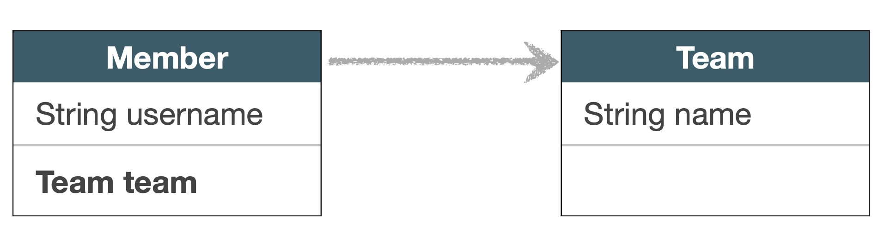   |

</br>

- 사용하지 않는데 쿼리를 날리면 비효율적 아닌가?

</br>

</br>

|                    em.getReference                     |
| :----------------------------------------------------: |
| 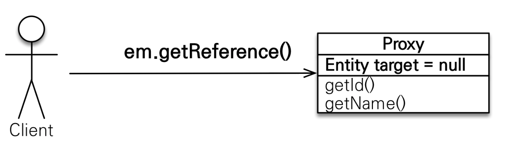 |

- 프록시 기초
  - em.find(): 데이터베이스를 통해서 실제 엔티티 객체 조회
  - em.getReference(): 데이터베이스 조회를 미루는 가짜(프록시) 엔티티 객체 조회

</br>

|                  em.find() 쿼리 시점                   |
| :----------------------------------------------------: |
| 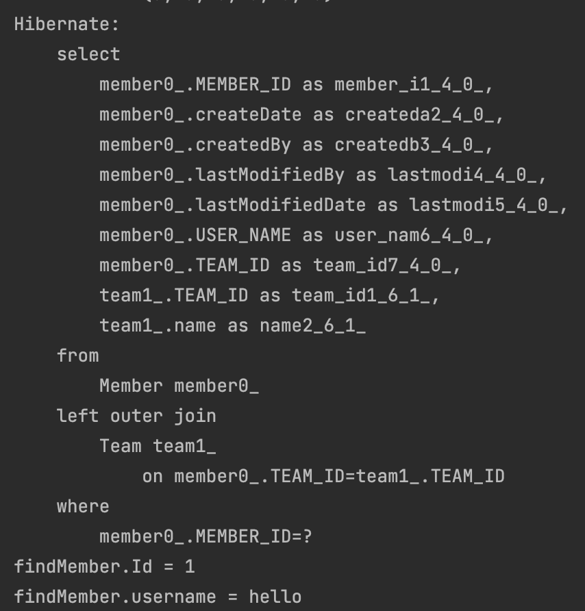 |

</br>

|                  em.getReference() 쿼리 시점                   |
| :------------------------------------------------------------: |
| 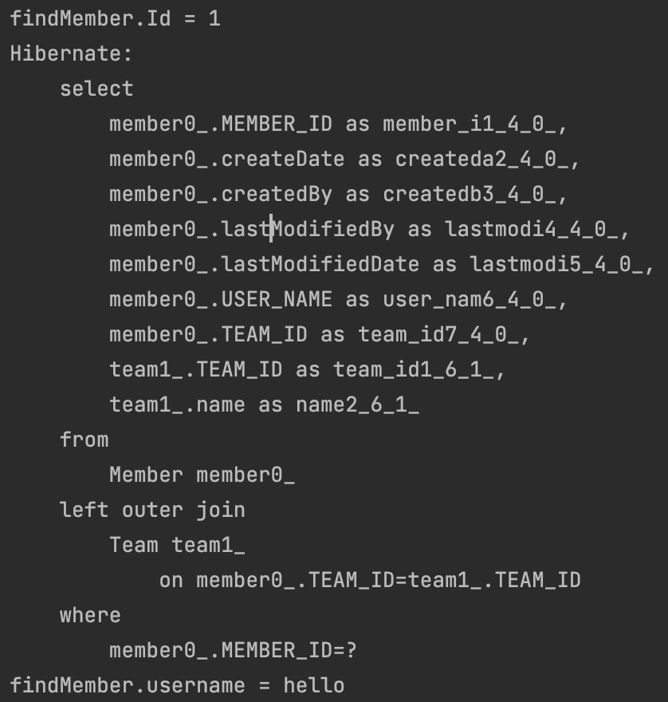 |

</br>

> 쿼리가 날아가는 시점이 다르다.  
> find()같은 경우에는 메서드 호출 시점에 쿼리가 된 후에 값을 가져오는 반면  
> `getReference()에서는 getUserName() 즉 실질적으로 값을 사용할 때`  
> 쿼리가 실행되는 것을 알 수 있다.  
> id가 먼저 출력되는 이유는 reference를 찾을 때 id 값을 넣었기 때문!

</br>

```text

findMember.class = class hellojpa.Member$HibernateProxy$Lmm65CYX

```

</br>

> 그리고 class 타입도 hibernate가 생성한 proxy 타입으로 나온다,

</br>

- 프록시 특징
  - 실제 클래스를 `상속 받아서 만들어짐`
  - 실제 클래스와 겉 모양이 같다,
  - 사용자는 진짜 객체인지 프록시 객체인지 구분하지 않고 사용해도 모른다...
  - 프록시 객체는 `실제 객체의 참조(target)를 보관`
  - 프록시 객체는 처음 사용할 때 `한 번만 초기화`
    - `프록시 객체가 실제 엔티티로 바뀌는 것은 아니다.` 프록시 객체 통해서 실제 엔티티에 접근 가능
  - 프록시 객체는 원본 엔티티를 상속 받는데, 따라서 타입 체크 주의
    - `instance of로 비교`
  - 영속성 컨텍스트에 엔티티가 있다면, 실제 엔티티를 찾아온다
  - 준영속 상태일 때, 프록시를 초기화 하면 문제 발생 - hibernate는
    - `org.hibernate.LazyInitializationException 예외`

|               프록시 객체 초기화                |
| :---------------------------------------------: |
| 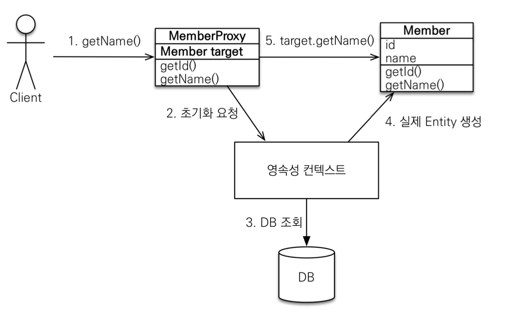 |

</br>

- 처음에는 target에 값이 없다.
- 실제 entity 값을 사용하려고 할때 영속성컨텍스트가 db에서 실제 entity를 조회 한다.
- 그 후 target과 실제 Member entity를 연결한다.

</br>

- 프록시 확인
  - 프록시 인스턴스의 초기화 여부 확인
    - PersistenceUnitUtil.isLoaded(Object enttity)
  - 프록시 클래스 확인
    - entity.getClass().getName() 출력
  - 프록시 강제 초기화
    -org.hibernate.Hibernate.initialize(entity);

</br>

## 즉시 로딩과 지연 로딩

</br>

```java

@ManyToOne(fetch = FetchType.LAZY)
    @JoinColumn(name = "TEAM_ID", insertable = false, updatable = false)
    private Team team;

```

> 실제 team을 사용할때 DB에서 값을 가져오겠다.  
> 그니까 값을 사용할때 쿼리를 날리기 위해,  
> Proxy 객체로 초기화 하겠다.

</br>

```java

tx.begin();

        try{

            //1. team 영속화
            Team team = new Team("teamA");
            em.persist(team);

            //2. member 영속화
            Member member = new Member("hello");
            member.setTeam(team);

            em.persist(member);

            //3. 영속성 컨텍스트 정리
            em.flush();
            em.clear();

            // 4. 멤버 조회
            Member m = em.find(Member.class, member.getId());
            System.out.println("m = " + m.getTeam().getClass());

            tx.commit();//4. 실제 쿼리 날아가는 시점
        }catch (Exception e){
            tx.rollback();
        }

```

</br>

|                실행코드 조회                 |
| :------------------------------------------: |
| 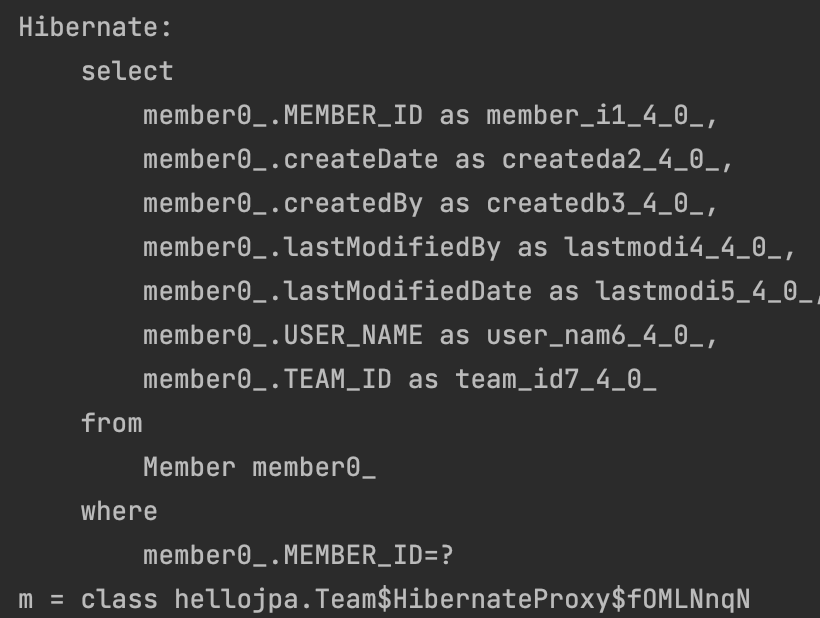 |

</br>

> Member를 조회할 때 Team에 대한 정보가 쿼리로 날아오지 않음.  
> Team은 proxy 객체로 초기화 됨을 알 수 있다.  
> 그 후 실제 Team의 정보를 사용할 때 쿼리가 실행 된다.

</br>

|                     동작                     |
| :------------------------------------------: |
| 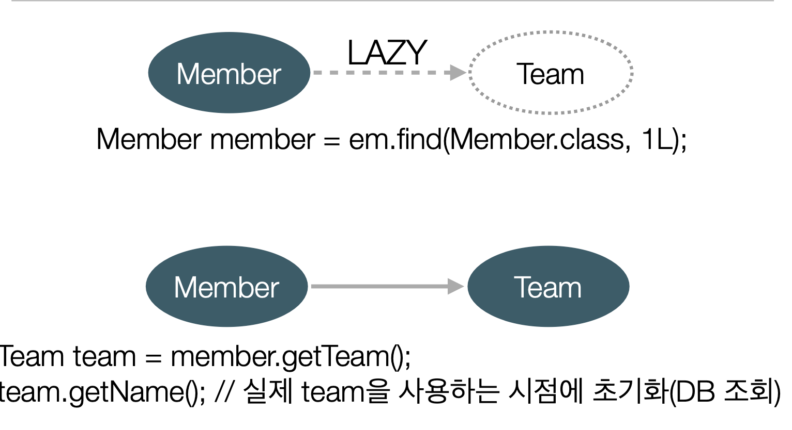 |

</br>

|        FetchType.EAGER로 변경        |
| :----------------------------------: |
| 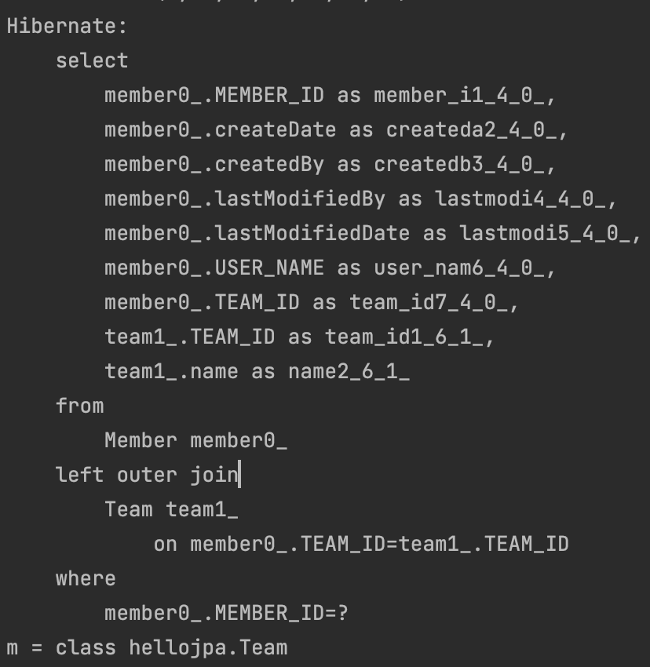 |

</br>

- 이른 초기화를 사용하면
  - Member를 조회할 때 left outer join이 발생하여 team을 모두 가져온다.
  - `프록시 객체로 초기화 한 것이 아니기 때문에` member의 team 클래스 타입은 프록시가 아니라 team이다!

</br>

### 프로깃와 즉시로딩 주의

- 가급적 지연 로딩만 사용
- 즉시 로딩을 사용할 경우 예상하지 못한 SQL이 발생
- 즉시 로딩은 `JPQL에서 N+1 문제`
- @ManyToOne, @OneToOne은 기본이 즉시로딩이다.
  - `FetchType.lazy로 변경하여 사용하라`

</br>

- JPQL

```java

@ManyToOne(fetch = FetchType.EAGER)
    @JoinColumn(name = "TEAM_ID")
    private Team team;

```

```java

tx.begin();

        try{

            //1. team 영속화
            Team team = new Team("teamA");
            em.persist(team);

            //2. member 영속화
            Member member = new Member("hello");
            member.setTeam(team);

            em.persist(member);

            //3. 영속성 컨텍스트 정리
            em.flush();
            em.clear();

            List<Member> members = em.createQuery("select m from Member m", Member.class)
                    .getResultList();

            tx.commit();//4. 실제 쿼리 날아가는 시점
        }catch (Exception e){
            tx.rollback();
        }

```

</br>

|               N+1                |
| :------------------------------: |
| 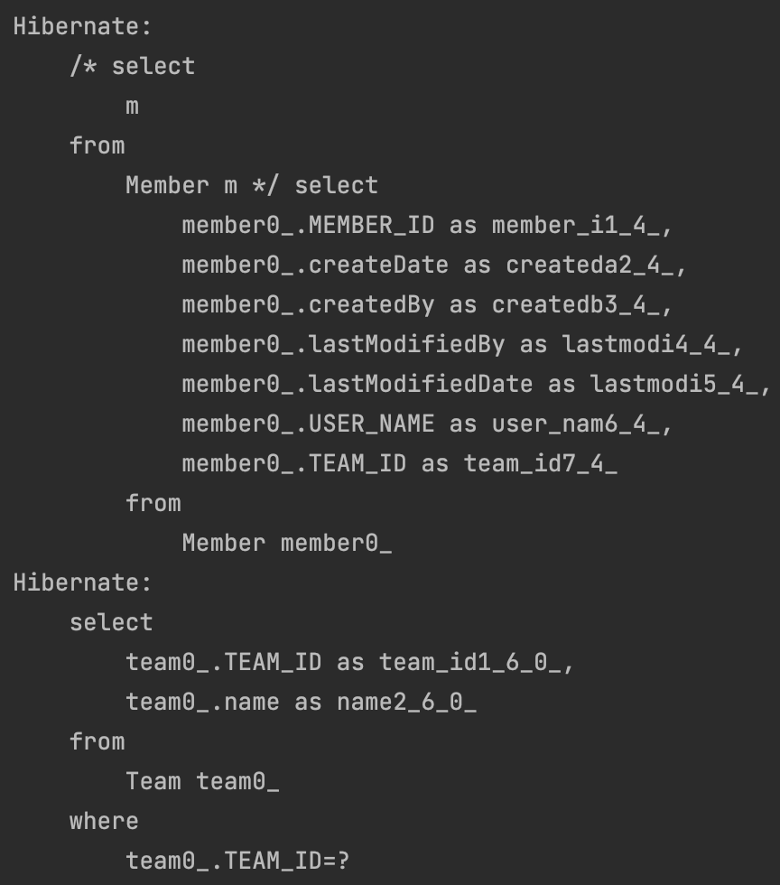 |

</br>

> 멤버가 이른초기화 전략을 사용할 때  
> em.find()같은 경우 join 최적화를 통해 쿼리가 날아가는 반면에  
> JPQL에서는 Member만 불러들였지만,  
> 내부적으로 Team의 값이 비어있으면 안된다고 판단하여  
> `Team을 바로 불러들여와 의도하지 않은 쿼리(Team 조회)가 날아간다.`

</br>

## 영속성 전이(CASCADE)와 고아 객체

</br>

- 영속성 전이

  - 특정 엔티티를 영속 상태로 만들 때 연관된 엔티티도 함께 영속상태로 만들고 싶다.
    - 부모 엔티티를 저장할 때 자식 엔티티도 함께 저장.

- CASACADE의 종류
  - ALL : 모두 적용
  - PERSIST : 영속
  - REMOVE : 삭제
  - MERGE : 병합
  - REFRESh : REFERESH
  - DETACH : DETACH

</br>

```java
@Entity
public class Parent {

    @Id
    @GeneratedValue
    private Long id;

    private String name;

    @OneToMany(mappedBy = "parent", cascade = CascadeType.PERSIST)
    private List<Child> children = new ArrayList<>();

    public void addChild(Child child){
        child.setParent(this);
    }

    protected Parent(){}

    public Parent(String name) {
        this.name = name;
    }
}


```

```java

@Entity
public class Child {

    @Id
    @GeneratedValue
    private Long id;

    private String name;

    @ManyToOne(fetch = FetchType.LAZY)
    @JoinColumn(name = "PARENT_ID")
    private Parent parent;

    protected Child(){}

    public Child(String name) {
        this.name = name;
    }


    public void setParent(Parent parent) {
        if(Objects.nonNull((this.parent))){
            this.parent.getChildren().remove(this);
        }

        parent.getChildren().add(this);
        this.parent = parent;
    }
}
```

</br>

- 실행 코드

```java

  tx.begin();

        try{
            Parent parent = new Parent("parent");

            Child child1 = new Child("child1");
            Child child2 = new Child("child1");

            parent.addChild(child1);
            parent.addChild(child2);

            // 부모만 persist
            em.persist(parent);

            tx.commit();//4. 실제 쿼리 날아가는 시점
        }catch (Exception e){
            tx.rollback();
        }

```

</br>

|             실행 코드 결과             |
| :------------------------------------: |
| 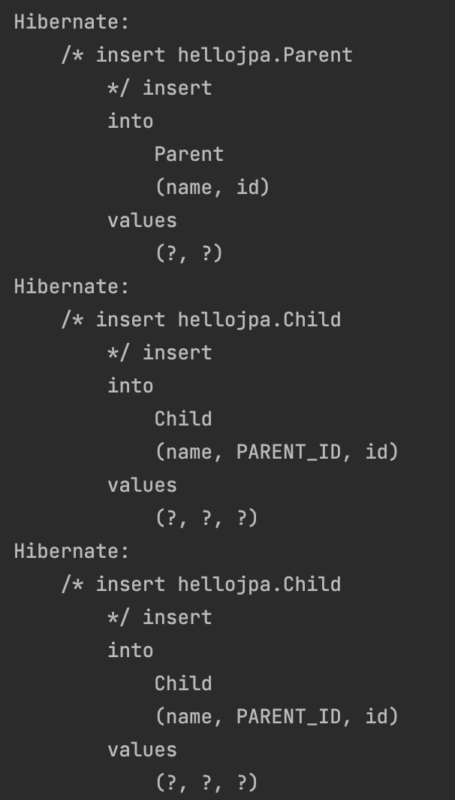 |

</br>

> 위 코드에서는 parent 클래스에서 영속성 전이 옵션을 persist로 주어  
> parent가 영속화 될 때 child 클래스들도 같이 영속화 됨을 확인할 수 있다.

</br>

- 반대는?

```java

@ManyToOne(fetch = FetchType.LAZY, cascade = CascadeType.PERSIST)
    @JoinColumn(name = "PARENT_ID")
    private Parent parent;

```

> 반대도 옵션을 걸 수 있다.  
> 이때는 자식이 persist될 때 parent가 영속화 되는 구조이다.

</br>

```java

tx.begin();

        try{
            Parent parent = new Parent("parent");

            Child child1 = new Child("child1");
            Child child2 = new Child("child1");

            parent.addChild(child1);
            parent.addChild(child2);

            em.persist(child1);

            tx.commit();//4. 실제 쿼리 날아가는 시점
        }catch (Exception e){
            tx.rollback();
        }

```

</br>

|            실행 코드 결과            |
| :----------------------------------: |
| 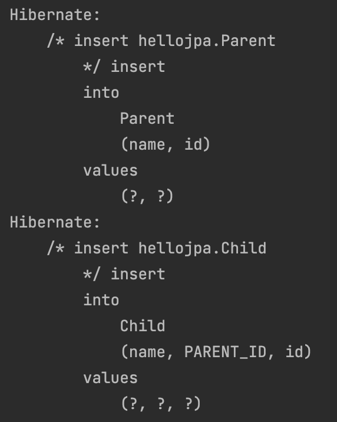 |

</br>

> 예상했던 대로 child1이 영속화 될때,  
> parent가 영속화 되어  
> 최종적으로 insert 쿼리가 두 개 실행됨을 확인할 수 있다.

</br>

### 영속성 전이 주의점

</br>

- 쓰면 안되는 경우
  - 소유자가 1개가 아닐때, 즉 지금과 같은 구조는 child를 하나의 parent가 관리하는데, 그렇지 않을때는 사용하면 안돼!

</br>

## 고아 객체

- 고아 객체 제거: 부모 엔티티와 연관관계가 끊어진 자식 엔티티를 자동으로 삭제
  - orphanRemoval = true
    - 이 옵션은 @OneToMany만 있다!

```java

tx.begin();

        try{
            Parent parent = new Parent("parent");

            Child child1 = new Child("child1");
            Child child2 = new Child("child1");

            parent.addChild(child1);
            parent.addChild(child2);

            em.persist(parent);

            em.flush();
            em.clear();

            Parent findParent = em.find(Parent.class, parent.getId());
            findParent.getChildren().remove(0);

            tx.commit();//4. 실제 쿼리 날아가는 시점
        }catch (Exception e){
            tx.rollback();
        }

```

</br>

|                실행 코드                 |
| :--------------------------------------: |
| 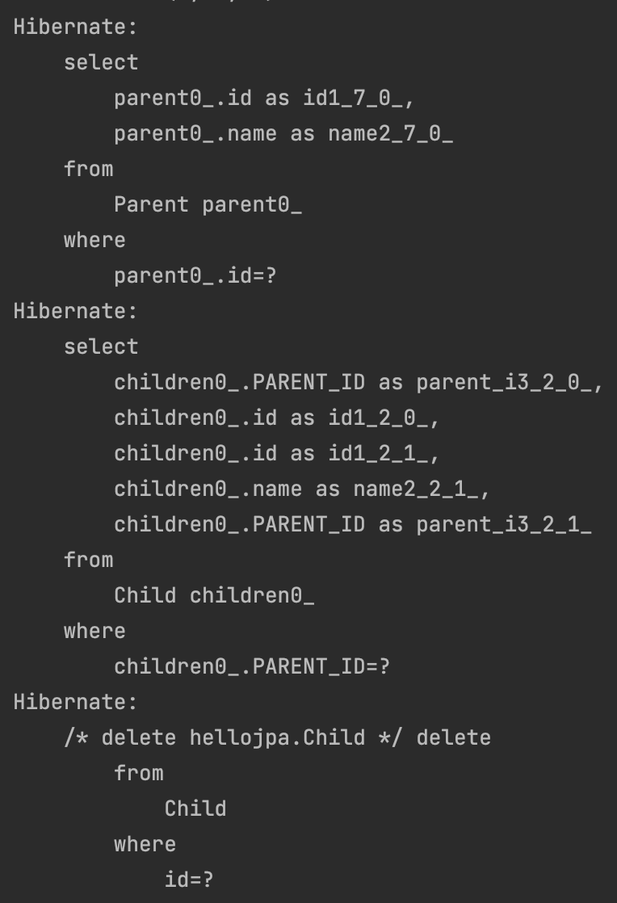 |

</br>

> 연관관계를 끊음으로써 delete 쿼리가 날아간다.

### 고아 객체 - 주의

</br>

- 참조가 제거된 엔티티는 다른 곳에서 참조하지 않는 고아객체로 보고 삭제해야한다.
  - 참조하는 곳이 하나일 때
  - 특정 엔티티가 개인 소유할때!
  - @OneToOne, @OneToMany만 가능

</br>

> 부모를 제거하면 자식은 고아가 된다.  
> 따라서 고아 객체 제거 기능을 활성화 하면,  
> 부모가 제거할 때 자식도 제거된다.  
> `CasacadeType.Remove처럼 동작.`  
> 주의해야된다.

</br>

- 영속성 전이 + 고아객체, 생명주기
  - CascadeType.ALL + orphanRemovel = true
  - 두 옵션을 모두 활성화 하면 부모 엔티티를 통해서 자식 생명주기 관리 가능

## 실전 예제 5 - 연관 관계 관리

- 글로벌 페치 전략 설정

  - 모든 연관관계를 지연 로딩

- Order -> Delivery를 영속성 전이 ALL 설정
- Order -> OrderItem을 영속성 전이 ALL 설정
