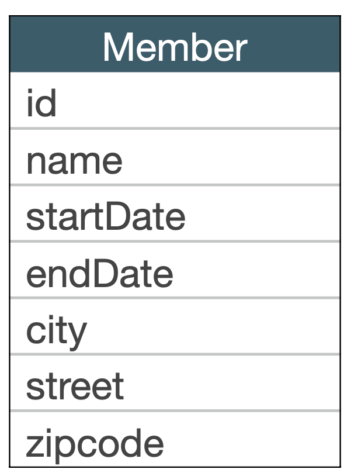
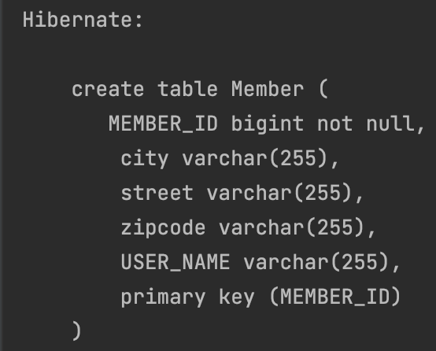
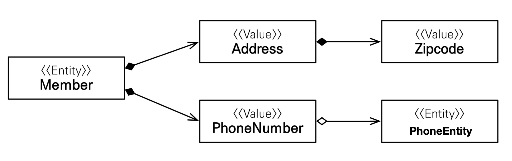
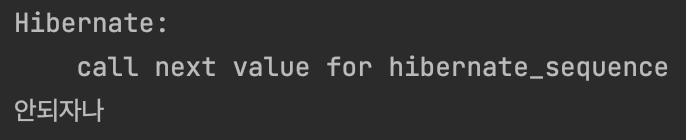
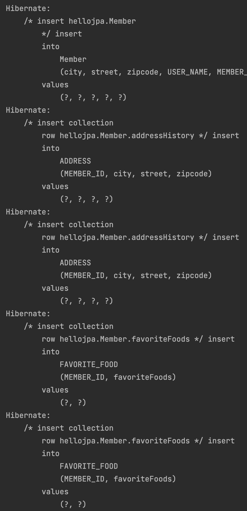
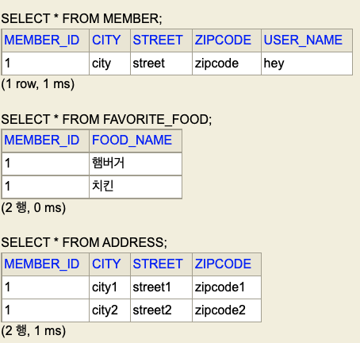
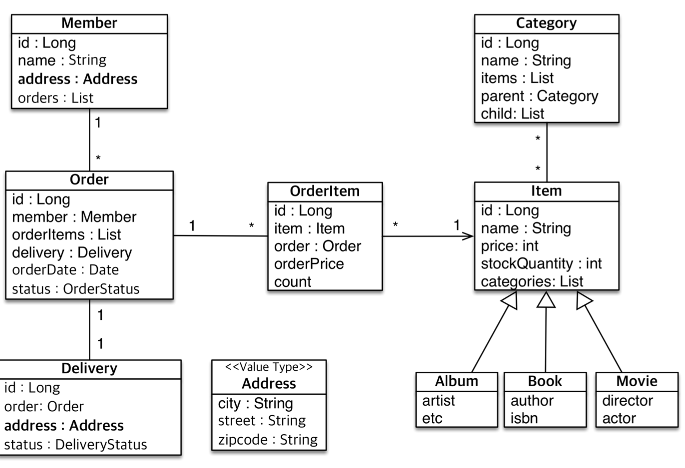

# 값 타입

## 기본값 타입

</br>

- JPA의 데이터 타입 분류
  - 엔티티 타입
    - @Entity로 정의하는 객체
    - 데이터가 변해도 식별자로 지속해서 추적 가능
  - 값 타입
    - int, Integer, String처럼 단순히 값으로 사용하는 자바 기본 타입이나 객체
    - 식별자가 없고 값만 있으므로 변경시 추적 불가

</br>

- 기본 값타입
  - primitive
  - wrapper
  - String
- embedded type
- collection

</br>

- 기본값 타입
  - 생명주기를 엔티티의 의존
  - 회원을 삭제하면 이름, 나이 필드도 함께 삭제
  - 값 타입은 공유하면 안된다. -> side effect

</br>

## 임베디드 타입

</br>

|                 Member                  |
| :-------------------------------------: |
|  |

</br>

> 비슷한 속성끼리 값을 묶어서 사용하는 것이 더 좋지 않을까.

</br>

- @Embeddable: 값 타입을 정의하는 클래스에 표시
- @Embedded: 값 타입을 사용하는 필드에 표시
- @Embeddable 클래스도 기본 생성자가 필요하다.

</br>

- 재사용 성
- 응집도
  - 해당 임베디드 타입에서 처리하는 로직이 모여있어 관리하기 좋다.

</br>

```java

@Entity
public class Member{

    @Id
    @GeneratedValue
    @Column(name = "MEMBER_ID")
    private Long id;

    @Column(name = "USER_NAME")
    private String name;

    @Embedded
    private Address address;

    protected Member(){}

    public Member(String name, Address address) {
        this.name = name;
        this.address = address;
    }
}

```

```java

@Embeddable
public class Address {

    private String city;
    private String street;
    private String zipcode;

    protected Address(){}

    public Address(String city, String street, String zipcode) {
        this.city = city;
        this.street = street;
        this.zipcode = zipcode;
    }

```

</br>

|                     실행 결과                     |
| :-----------------------------------------------: |
|  |

</br>

> 값이 유지되면서, 보다 더 객체지향적으로 사용이 가능하다.

</br>

|             잘 설계              |
| :------------------------------: |
|  |

</br>

> 잊지 말자, 임베디드 타입도 엔티티를 가질 수 있다.

</br>

- @AttributeOverride : 속성 재정의
  - 한 엔티티에서 같은 값 타입을 사용하려면?
    - 컬럼명이 중복 될 것이다.
  - @AttributeOverrides나 @AttributeOverride사용해서 컬럼 명 속성을 재정의 하자!
  - 솔직히 잘 안쓸 것같다...
- `임베디드 타입 클래스 자체가 null이면 매핑한 컬럼 모두가 null이다`

</br>

### 그러면 임베디드 타입 필드 nullable은?

```java
@Embeddable
public class Address {

    @Column(nullable = false)
    private String city;
    private String street;
    private String zipcode;

    protected Address(){}

    // city가 null이 되게 하기위해 강제적으로 불필요한 생성자 작성
    public Address(String street, String zipcode) {
        this.street = street;
        this.zipcode = zipcode;
    }

    public Address(String city, String street, String zipcode) {
        this.city = city;
        this.street = street;
        this.zipcode = zipcode;
    }

```

</br>

```java

tx.begin();

        try{
            Member member = new Member(
                    "hey",
                    new Address("street", "zipcode")
            );

            em.persist(member);

            tx.commit();//4. 실제 쿼리 날아가는 시점
        }catch (Exception e){
            System.out.println("안되자나");
            tx.rollback();
        }

```

</br>

|                  실행 결과                  |
| :-----------------------------------------: |
|  |

</br>

- 값이 들어가지 않고 예외가 터진다.

> @Embeddable로 정의된 임베디드 타입 클래스 필드에 @Column 제약을 걸어주면 된다!

## 값 타입과 불변 객체

</br>

- 값타입 공유 참조
  - 우리가 흔히 값을 공유한다 생각해서 그냥 사용하면 안된다.
  - 객체는 참조다

> A 클래스를 참조하는 B클래스가 있을때  
> A값이 변경된다면, 의도하지 않는 B 클래스의 필드 값이 변경 될 것이다.  
> 당연한 이야기..

</br>

### 불변 객체

</br>

- 생성 시점 이후 절대 값을 변경하게 하면 안된다.
  - setter를 제한한다.
  - referene type 필드를 애플리케이션 환경에서 꺼내 써야하는 상황이 온다면 주의해야한다.
    - `왠만하면 reference 내부에서 비즈니스 로직을 처리하려고 노력해야함`

</br>

## 값 타입의 비교

</br>

- 동일성 비교 : 인스턴스의 참조 값을 비교
  - ==
- 동등성 비교 : 인스턴스의 값을 비교
  - equals

</br>

## 값 타입 컬렉션

</br>

- 값 타입 하나 이상 저장할 때 사용
- @ElementCollection, @CollectionTable 사용
- `데이터베이스는 컬렉션을 같은 테이블에 저장할 수 없다.`
  - 컬렉션을 저장하기 위한 별도의 테이블이 필요함.

</br>

```java

@Entity
public class Member {

    @Id
    @GeneratedValue
    @Column(name = "MEMBER_ID")
    private Long id;

    @Column(name = "USER_NAME")
    private String name;

    @Embedded
    private Address address;

    @ElementCollection
    @Column(name = "FOOD_NAME")
    @CollectionTable(name = "FAVORITE_FOOD", joinColumns =
        @JoinColumn(name = "MEMBER_ID")
    )
    private Set<String> favoriteFoods = new HashSet<>();

    @ElementCollection
    @CollectionTable(name = "ADDRESS", joinColumns =
        @JoinColumn(name = "MEMBER_ID")
    )
    private List<Address> addressHistory = new ArrayList<>();

    protected Member() {
    }

    public Member(String name, Address address, Set<String> favoriteFoods, List<Address> addressHistory) {
        this.name = name;
        this.address = address;
        this.favoriteFoods = favoriteFoods;
        this.addressHistory = addressHistory;
    }
}

```

</br>

> `Set은 컬렉션이지만, 단일 필드임으로 @Column을 통해 옵션을 줄 수 있다!`

</br>

```java

tx.begin();

        try{

            //1. collection 세팅
            Set<String> favoriteFoods = new HashSet<>();
            favoriteFoods.add("햄버거");
            favoriteFoods.add("치킨");

            List<Address> addressHistory = new ArrayList<>();
            addressHistory.add(new Address("city1", "street1", "zipcode1"));
            addressHistory.add(new Address("city2", "street2", "zipcode2"));

            // 2. member 생성
            Member member = new Member(
                    "hey",
                    new Address("city","street", "zipcode"),
                    favoriteFoods,
                    addressHistory
            );

            // 3. 영속화
            em.persist(member);

            tx.commit();//4. 실제 쿼리 날아가는 시점
        }catch (Exception e){
            System.out.println("안되자나");
            tx.rollback();
        }

```

</br>

|           실행 결과 - 콘솔            |
| :-----------------------------------: |
|  |

|         실행 결과 - h2 콘솔         |
| :---------------------------------: |
|  |

</br>

> Collection과 매핑되는 테이블들이 생성되고  
> insert 쿼리시, collection이 insert 된다고 로그를 통해 확인할 수 있다.  
> 또 Set의 Column 지정한 이름이 잘 들어간 것도 확인 된다!

</br>

- 컬렉션 테이블도 별도로 영속성 관리를 하지 않는다.
  - 예제에서는 Member가 모든 것을 관리 한다.
    - CASACADE.ALL + orphanremovel = true
  - 조회는 `지연로딩 전략이 default다.`

</br>

### 값타입 컬렉션의 제약사항, 주의

</br>

- 엔티티와 다르게 식별자 개념이 없다.
  - 이로인해 값이 변경될 경우 추적이 어렵다.
- update가 발생하면
  - 주인 엔티티와 연관된 데이터를 `일단 삭제`
  - 그 후 남아있는 값 타입 컬렉션에 있는 값을 `다시 저장`
  - 쿼리가 두 번 날아간다...
- 값 타입 컬렉션을 매핑하는 테이블은 `모든 컬럼을 묶어서 기본 키를 묶어서 구성...`

</br>

### 값 컬렉션 대안

- 1:N 관계로 풀기
- 그리고 여기에서 값 타입을 사용
  - CASACADE.ALL + orphanremovel = true처럼 사용

```java
@Entity
public class Member {

    @Id
    @GeneratedValue
    @Column(name = "MEMBER_ID")
    private Long id;

    @Column(name = "USER_NAME")
    private String name;

    @Embedded
    private Address address;

    @ElementCollection
    @Column(name = "FOOD_NAME")
    @CollectionTable(name = "FAVORITE_FOOD", joinColumns =
        @JoinColumn(name = "MEMBER_ID")
    )
    private Set<String> favoriteFoods = new HashSet<>();

//    @ElementCollection
//    @CollectionTable(name = "ADDRESS", joinColumns =
//        @JoinColumn(name = "MEMBER_ID")
//    )
//    private List<Address> addressHistory = new ArrayList<>();

    @OneToMany(cascade = CascadeType.ALL, orphanRemoval = true)
    @JoinColumn(name = "MEMBER_ID")
    private List<AddressEntity> addressHistory = new ArrayList<>();

    protected Member() {
    }

    public Member(String name, Address address, Set<String> favoriteFoods, List<AddressEntity> addressHistory) {
        this.name = name;
        this.address = address;
        this.favoriteFoods = favoriteFoods;
        this.addressHistory = addressHistory;
    }
}

```

```java

@Entity
@Table(name = "ADDRESS")
public class AddressEntity {

    @Id
    @GeneratedValue
    private Long id;

    @Embedded
    private Address address;

    protected AddressEntity(){}

    public AddressEntity(Address address) {
        this.address = address;
    }

    public Long getId() {
        return id;
    }

    public Address getAddress() {
        return address;
    }

    public void setAddress(Address address) {
        this.address = address;
    }
}


```

## 실전 예제 6 - 값 타입 매핑

|               실전 예제                |
| :------------------------------------: |
|  |
