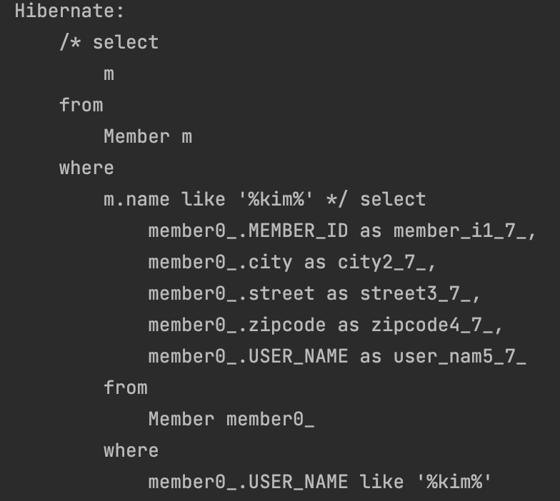
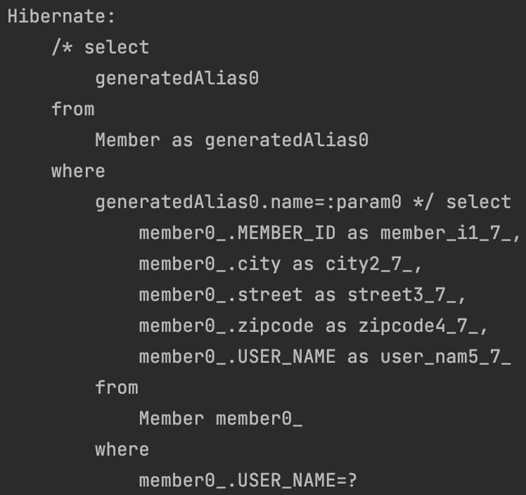
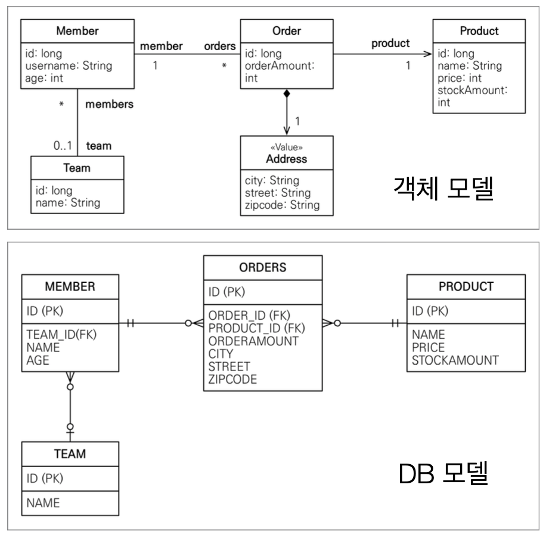
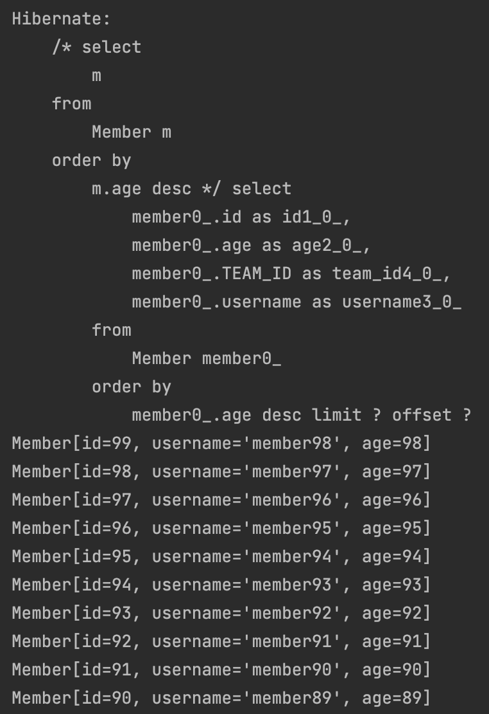
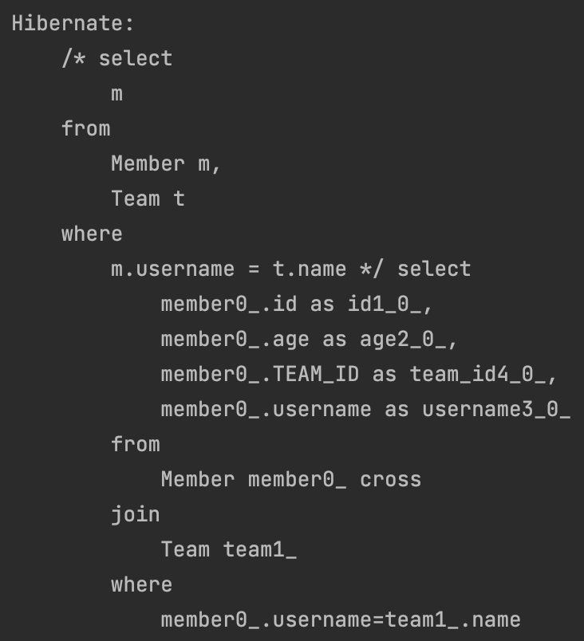

# 객체지향 쿼리 언어1 - 기본 문법

## 소개

</br>

- JPQL 소개
  - EntityManager.find()
  - 객체 그래프 탐색(a.getB().getC())
- JPA를 사용하면 엔티티 객체를 중심으로 개발
- 문제는 검색 쿼리
- 검색을 할 때도 테이블이 아닌 엔티티 객체를 대상으로 검색
- 모든 DB 데이터를 객체로 변환해서 검색하는 것은 불가능
- 애플리케이션이 필요한 데이터만 DB에서 불러오려면 결국 검색 조건이 포함된 SQL이 필요

</br>

```java

tx.begin();

        try{

            List<Member> result = em.createQuery("select m from Member m where m.name like '%kim%'",
                            Member.class
                    ).getResultList();

            tx.commit();//4. 실제 쿼리 날아가는 시점
        }catch (Exception e){
            System.out.println(e.getMessage() + e);
            tx.rollback();
        }

```

|                jpql 예시                |
| :-------------------------------------: |
|  |

- JPQL은 엔티티 객체를 대상으로 쿼리!
- 객체지향 SQL

</br>

- Criteria

```java

tx.begin();

        try{

            CriteriaBuilder cb = em.getCriteriaBuilder();
            CriteriaQuery<Member> query = cb.createQuery(Member.class);

            Root<Member> m = query.from(Member.class);

            CriteriaQuery<Member> cq = query.select(m).where(cb.equal(m.get("name"), "kim"));
            List<Member> resultList = em.createQuery(cq)
                    .getResultList();


            tx.commit();//4. 실제 쿼리 날아가는 시점
        }catch (Exception e){
            System.out.println(e.getMessage() + e);
            tx.rollback();
        }

```

|                criteria 예시                |
| :-----------------------------------------: |
| ) |

> JPQL 이용시 동적 쿼리 작성할 때 문자열을 붙이는 등  
> 운영상에서 성능 저하 및 실수할 여지를 만들게 된다...  
> 그래서 criteria 쓰는 건가?  
> 근데 sql스럽지가 않다...  
> 알아보기가 어려워서 유지보수하기 어렵다.

</br>

- QueryDSL
  - 문자가 아닌 자바코드로 JPQL 작성 가능
    - JPQL 빌더 역할
  - 컴파일 타임에 문법 오류 찾을 수 있음
  - 동적 쿼리작성이 편하다.

</br>

- Native SQL 소개
  - JPA가 제공하는 SQL 직접 사용
  - JPQL로 해결할 수 없는 특정 데이터베이스에 의존적인 기능

</br>

- JDBC 직접사용, SpringJdbcTemplate
  - JPA를 사용하면서 JDBC 커넥션을 직접 사용하거나, 스프링 JdbcTemplate, 마이바티스등을 함께 사용 가능
  - 단 영속성 컨텍스트를 적절한 시점에 강제로 플러시 필요
  - JPA를 우회하여 SQL을 실행하기 직전에 영속성 컨텍스트 수동 플러시..

</br>

## 기본 문법과 쿼리 API

</br>

|                 프로젝트 도메인 구성                 |
| :--------------------------------------------------: |
|  |

</br>

- TypeQuery, Query
  - TypeQuery: 반환 타입이 명확할 때 사용
  - Query: 반환 타입이 명확하지 않을 때 사용

</br>

- 결과 조회 API

  - query.getResultList()
    - 결과가 하나 이상일때, 리스트 반환
    - 결과가 없으면 빈 리스트 반환
  - query.getSingleResult()
    - 결과가 정확히 하나, 단일 객체
    - 결과가 없으면: javax.persistence.NoResultException
    - 둘 이상이면: javax.persistence.NonUniqueResultException

- 파라미터 바인딩

</br>

```java

TypedQuery<Member> query = em.createQuery("select m from Member m where m.username = :username", Member.class);
            query.setParameter("username", "cheolsu");
            query.getSingleResult();

```

</br>

## 프로젝션(SELECT)

</br>

- SELECT 절에 조회할 대상을 지정하는 것
- 프로젝션 대상: 엔티티. 임베디드 타입, 스칼라 타입
- SELECT m : 엔티티
- SELECT m.team : 엔티티
- SELECT m.address : 임베디드
- SELECT m.username : 스칼라

</br>

```java

tx.begin();

        try{
            Member member = new Member("member1", 10);
            em.persist(member);

            em.flush();
            em.clear();

            List<Member> result = em.createQuery("select m from Member m", Member.class)
                    .getResultList();

            Member findMember = result.get(0);
            findMember.setAge(20);

            tx.commit();//4. 실제 쿼리 날아가는 시점
        }catch (Exception e){
            System.out.println(e.getMessage() + e);
            tx.rollback();
        }

```

</br>

> `엔티티 매니저 프로젝션은 영속성 컨텍스트에서 관리함으로 update 쿼리가 날아간다.`

</br>

```java
tx.begin();

        try{
            Member member = new Member("member1", 10);
            em.persist(member);

            em.flush();
            em.clear();

            List<Team> result = em.createQuery("select m.team from Member m", Team.class)
                    .getResultList();

//            List<Team> result = em.createQuery("select t from Member m join m.team t", Team.class)
//                    .getResultList();

            tx.commit();//4. 실제 쿼리 날아가는 시점
        }catch (Exception e){
            System.out.println(e.getMessage() + e);
            tx.rollback();
        }

```

|           Member.team 호출 할 때            |
| :-----------------------------------------: |
|  |

</br>

- 스칼라

```java

List resultList = em.createQuery("select m.username, m.age from Member m").getResultList();

            Object o = resultList.get(0);
            Object[] result = (Object[]) o;
            System.out.println("username  = " + result[0]);
            System.out.println("age  = " + result[1]);

```

> 너무 지저분해서 권장하지는 않는 방식

</br>

- 굳이 스칼라로 뽑아서 쓸거면, DTO를 하나 만들어주자.

</br>

```java

public class MemberDTO {

    private String username;
    private int age;

    public MemberDTO(String username, int age) {
        this.username = username;
        this.age = age;
    }

    public String getUsername() {
        return username;
    }

    public int getAge() {
        return age;
    }

    @Override
    public String toString() {
        return new StringJoiner(", ", MemberDTO.class.getSimpleName() + "[", "]")
                .add("username='" + username + "'")
                .add("age=" + age)
                .toString();
    }
}

```

```java

        tx.begin();

        try{
            Member member = new Member("member1", 10);
            em.persist(member);

            em.flush();
            em.clear();

            List<MemberDTO> resultList = em.createQuery("select new jpql.MemberDTO(m.username, m.age) from Member m").getResultList();

            resultList.forEach(System.out::println);

            tx.commit();//4. 실제 쿼리 날아가는 시점
        }catch (Exception e){
            System.out.println(e.getMessage() + e);
            tx.rollback();
        }

```

</br>

## 페이징

</br>

- JPA는 페이징을 두 몌ㅑ로 추상화
  - setFirstResult(int startPosition) : 조회 시작 위치 0부터 시작
  - setMaxResults(int maxResult): 조회할 데이터 수

```java

tx.begin();

        try{
            for(int i=0; i< 100 ;i++) {
                Member member = new Member("member" + i,  i);
                em.persist(member);
            }
            em.flush();
            em.clear();

            List<Member> resultList = em.createQuery("select m from Member m order by m.age desc", Member.class)
                    .setFirstResult(1)
                    .setMaxResults(10)
                    .getResultList();

            resultList.forEach(System.out::println);

            tx.commit();//4. 실제 쿼리 날아가는 시점
        }catch (Exception e){
            System.out.println(e.getMessage() + e);
            tx.rollback();
        }

```

</br>

|                 paging                 |
| :------------------------------------: |
|  |

</br>

> setFirstResult(1)로 설정했기때문에 offset 설정  
> 역순으로 데이터 10개 뽑아오기.

</br>

- 페이징 방언 - MySQL

```java

SELECT
    M.ID AS ID,
    M.AGE AS AGE,
    M.TEAM_ID AS TEAM_ID,
FROM
ORDER BY
    M.NAME AS NAME
MEMBER M
    M.NAME DESC LIMIT ?, ?

```

- 페이징 방언 - Oracle

```java

SELECT * FROM
    ( SELECT ROW_.*, ROWNUM ROWNUM_
    FROM
        ( SELECT
            M.ID AS ID,
            M.AGE AS AGE,
            M.TEAM_ID AS TEAM_ID,
            M.NAME AS NAME
          FROM MEMBER M
          ORDER BY M.NAME
        )ROW_
    WHERE ROWNUM <= ?
    )
WHERE ROWNUM_ > ?

```

</br>

## 조인

</br>

- 내부 조인
  - SELECT m FROM Member m JOIN m.team t
- 외부 조인:
  - SELECT m FROM Member m LEFT JOIN m.teaa t
- 세타 조인:
  - SELECT COUNT(m) from Member m, Tema t where m.username = t.name

```java

String query = "select m from Member m, Team t where m.username = t.name";
            List<Member> resultList = em.createQuery(query, Member.class)
                            .getResultList();

```

|              세타 조인 예시              |
| :--------------------------------------: |
|  |

</br>

- 조인 ON절을 활용한 조인 (JPA 2.1부터 지원)

- 조인 대상 필터링
  - ex) 회원과 팀을 조인하면서, 팀 이름이 A인팀만 조인

```java
SELECT m, t FROM Member m LEFT JOIN m.team t on t.name = 'A'
```

```sql
SELECT m.*, t.*
FROM Member m LEFT JOIN Team t ON m.TEAM_ID=t.id and t.name='A'
```

</br>

- 연관관계 없는 엔티티 외부 조인

</br>

- ex) 회원의 이름과 팀의 이름이 같은 대상 외부 조인

```java
SELECT m, t FROM
Member m LEFT JOIN Team t on m.username = t.name
```

```sql
SELECT m.*, t.* FROM
Member m LEFT JOIN Team t ON m.username = t.name
```

</br>

## 서브 쿼리

</br>

- 나이가 평균보다 많은 회원

```java
select m from Member
where m.age > (select avg(m2.age) from Member m2)
```

- 한 건이라도 주문한 고객

```java
select m from Member
where (select count(o) from Order o where m = o.member) > 0
```

</br>

- 서브 쿼리 지원 함수

- [NOT] EXISTS(subquery) : 서브쿼리에 결과가 존재하면 참
  - {ALL | ANY | SOME}(subquery)
  - ALL 모두 만족하면 참
  - ANY, SOME: 같은 의미, 조건을 하나라도 만족하면 참
- [NOT] IN (subquery): 서브쿼리의 결과 중 하나라도 같은 것이 있으면 참

</br>

- 서브 쿼리 예제

- 팀 A 소속인 회원

```java
select m from Member
where exists (select t from m.team t where t.name = ‘팀A')
```

- 전체 상품 각각의 재고보다 주문량이 많은 주문들

```java
select o from Order o 

where o.orderAmount > ALL (select p.stockAmount from Product p)
```

- 어떤 팀이든 팀에 소속된 회원

```java
select m from Member m 

where m.team = ANY (select t from Team t)
```

</br>

- JPA 서브 쿼리 한계
  - JPA는 WHERE, HAVING 절에서만 서브 쿼리 사용 가능
  - SELECT 절도 가능(하이버네이트 지원)
  - FROM 절의 서브 쿼리는 현재 JPQL에서 불가능
    - 조인으로 풀 수 있으면 풀어서 해결

</br>

## JPQL 타입 표현과 기타식

</br>

- 문자: 'HELLO', 'she''s'
- 숫자: 10L, 10D, 10F
- Boolean: TRUE, FALSE
- ENUM: jpabook.MemberType.Admin(패키지명 포함)
- 엔티티타입: TYPE(m) = Member(상속에서만)

</br>

- JPQL 기타
- EXITS, IN
- AND, OR, NOT
- = , > >=, <, <>
- BETWEEN, LIKE, IS NULL

</br>

## 조건식(CASE 등등)

</br>

- 기본 케이스

```java
select
  case when m.age <= 10 then '학생요금'
  case when m.age >= 10 then '경로 요금'
       else '일반 요금'
from Member m
```

- 단순 케이스

```java
select
  case when '팀A' then '인세티브110'
  case when '팀B' then '인센티브120'
       else '인센티브105'
from Team t
```

</br>

- 사용자 이름이 없으면 이름 없는 회원을 반환

```java
select coalesce(m.username,'이름 없는 회원') from Member m
```

</br>

- 사용자 이름이 ‘관리자’면 null을 반환하고 나머지는 본인의 이름을 반환

```java
select NULLIF(m.username, '관리자') from Member m
```

</br>

## JPQL 함수

- CONCAT
- SUBSTRING
- TRIM
- LOWER, UPPER
- LENGTH
- LOCATE
- ABS, SQRT, MOD
- SIZE, INDEX(JPA 용도)

</br>

- 사용자 정의 함수 호출
  - 하이버네이트는 사용전 방언에 추가해야 한다.
  - 사용하는 DB 방언을 상속 받고, 사용자 정의 함수를 등록한다ㅣ

```java
select function('group_concat', i.name) from Item i
```
