# 객체지향 쿼리 언어2 - 중급 문법

## 경로 표현식

</br>

|                 경로 표현식                 |
| :-----------------------------------------: |
| 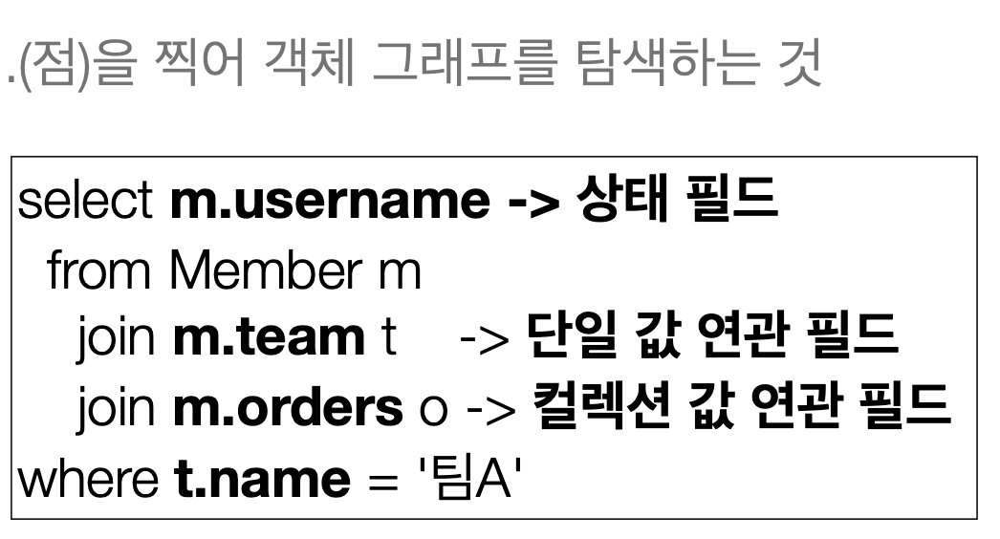 |

</br>

> 경로 표현식에 따라서 내부 동작방식에 따라 결과가 달라진다.

</br>

- 경로 표현식 용어 정리
  - 상태 필드 : 단순히 값을 저장하기 위한 필드
    - 경로 탐색의 끝, `탐색 X`
    - ex) m.username
  - 연관 필드 : 연관관계를 위한 필드
    - 단일 값 연관 필드
      - 묵시적 내부 조인 발생, `탐색 O`
      - @ManyToOne, @OneToOne, 대상이 엔티티
        - ex) m.team
    - 컬렉션 값 연관 필드
      - 묵시적 내부 조인 발생, `탐색 X`
      - FROM 절에서 명시적 조인을 통해 별칭을 얻으면 별칭을 통해 탐색 가능
      - @OneToMany, @ManyToMany, 대상이 컬렉션
        - ex) m.orders

</br>

```java
select m.team.name From Member m
```

> m.team은 연관 필드로 `묵시적 내부조인 발생`
> m.team.name은 상태필드로 `경로 탐색의 끝`

</br>

```java

tx.begin();

        try {

            Team team = new Team("teamA");
            em.persist(team);

            Member member = new Member("member1", 10);
            member.changeTeam(team);
            em.persist(member);

            em.flush();
            em.clear();

            String query = "select t.members From Team t";
            List resultList = em.createQuery(query, Collection.class)
                            .getResultList();

            resultList.forEach(System.out::println);

            tx.commit();//4. 실제 쿼리 날아가는 시점
        } catch (Exception e) {
            System.out.println(e.getMessage() + e);
            tx.rollback();
        }

```

|               컬렉션 값 연관 필드               |
| :---------------------------------------------: |
| 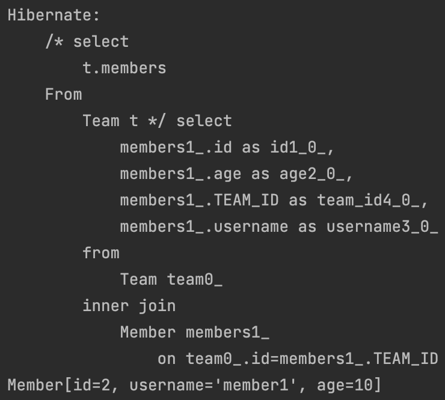 |

</br>

- 묵시적 조인 시 주의 사항
  - 항상 내부 조인
  - 컬렉션은 경로 탐색의 끝, 명시적 조인을 통해 별칭을 얻어야 함
  - 경로 탐색은 주로 SELECT, WHERE절에서 사용하지만 묵시적 조인으로 인해 SQL의 FROM JOIN절에 영향을 줌

</br>

- 그냥 명시적 조인을 사용해라
  - 조인이 SQL 튜닝에 중요 포인트다
  - 묵시적 조인은 조인이 일어난느 상황을 한눈에 파악하기 어렵다.
    - 유지보수 어려워..

</br>

## 페치 조인 1 - 기본

</br>

- SQL 조인 종류 X
- JPQL에서 `성능 최적화`를 위해 제공
- 연관된 엔티티나 컬렉션을 `SQL 한 번에 함께 조회`하는 기능
- `join fetch 명령어` 사용
- 페치조인::= [LEFT[OUTER]|INNER] JOIN FETCH 조인 경로
  - LEFT JOIN FETCH
  - JOIN FETCH

</br>

|                       예시                       |
| :----------------------------------------------: |
| 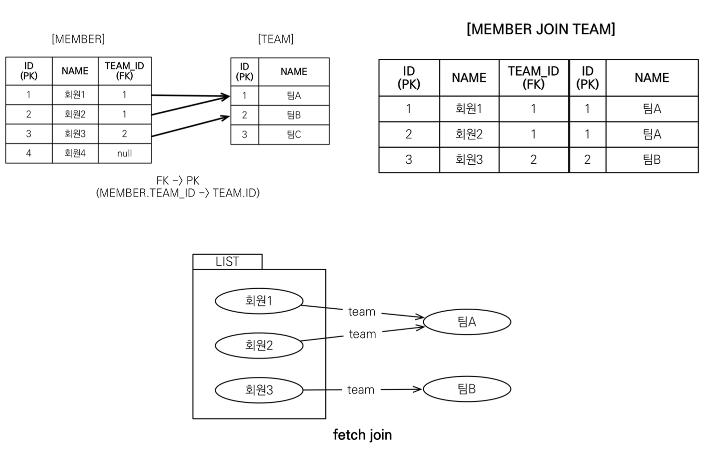 |

</br>

> 멤버 1,2 -> team A  
> 멤버 3은 -> team B

</br>

```java

tx.begin();

        try {

            // TEAM
            Team teamA = new Team("팀A");
            Team teamB = new Team("팀B");
            Team teamC = new Team("팀C");
            em.persist(teamA);
            em.persist(teamB);
            em.persist(teamC);

            //MEMBER
            Member member1 = new Member("회원1", 10);
            Member member2 = new Member("회원2", 10);
            Member member3 = new Member("회원3", 10);
            Member member4 = new Member("회원4", 10);
            member1.changeTeam(teamA);
            member2.changeTeam(teamA);
            member3.changeTeam(teamB);
            em.persist(member1);
            em.persist(member2);
            em.persist(member3);
            em.persist(member4);

            em.flush();
            em.clear();

            String jpql = "select m from Member m join fetch m.team";
            List<Member> members = em.createQuery(jpql, Member.class)
                            .getResultList();

            for (Member member : members){
                System.out.println("username = " + member.getUsername());
                System.out.println("teamName = " + member.getTeam().getName());
            }

            tx.commit();//4. 실제 쿼리 날아가는 시점
        } catch (Exception e) {
            System.out.println(e.getMessage() + e);
            tx.rollback();
        }

```

|                    실행 코드 결과                     |
| :---------------------------------------------------: |
| 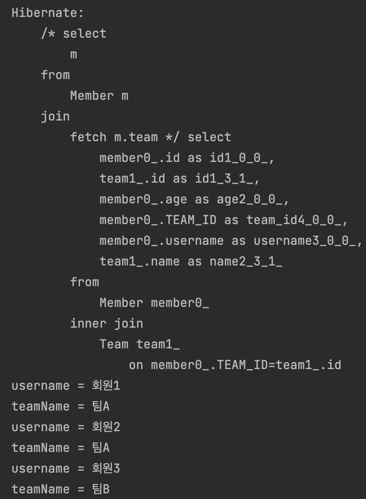 |

</br>

> 실제 쿼리가 실행 될 때, Team은 프록시가 아닌 실제 객체로 들어온다.  
> 쿼리 한 개로 모든 객체를 불러옴으로 N+1 쿼리문제 해소

</br>

> inner join임으로 member4는 미출력  
> left join으로 할 경우 member의 team은 null임으로 exception

</br>

> 또한 내가 지연 로딩으로 설정하더라도 항상 fetch join이 우선이다!

</br>

- 컬렉션 페치 조인

</br>

```java

tx.begin();

        try {

            // TEAM
            Team teamA = new Team("팀A");
            Team teamB = new Team("팀B");
            Team teamC = new Team("팀C");
            em.persist(teamA);
            em.persist(teamB);
            em.persist(teamC);

            //MEMBER
            Member member1 = new Member("회원1", 10);
            Member member2 = new Member("회원2", 10);
            Member member3 = new Member("회원3", 10);
            Member member4 = new Member("회원4", 10);
            member1.changeTeam(teamA);
            member2.changeTeam(teamA);
            member3.changeTeam(teamB);
            em.persist(member1);
            em.persist(member2);
            em.persist(member3);
            em.persist(member4);

            em.flush();
            em.clear();

            String jpql = "select t from Team t join fetch t.members";
            List<Team> resultList = em.createQuery(jpql, Team.class)
                            .getResultList();

            for (Team team : resultList){
                System.out.println("teamName = " + team.getName() + "|" + team.getMembers().size());
            }

            tx.commit();//4. 실제 쿼리 날아가는 시점
        } catch (Exception e) {
            System.out.println(e.getMessage() + e);
            tx.rollback();
        }

```

</br>

|                 1:N Collection 뻥튀기                  |
| :----------------------------------------------------: |
| 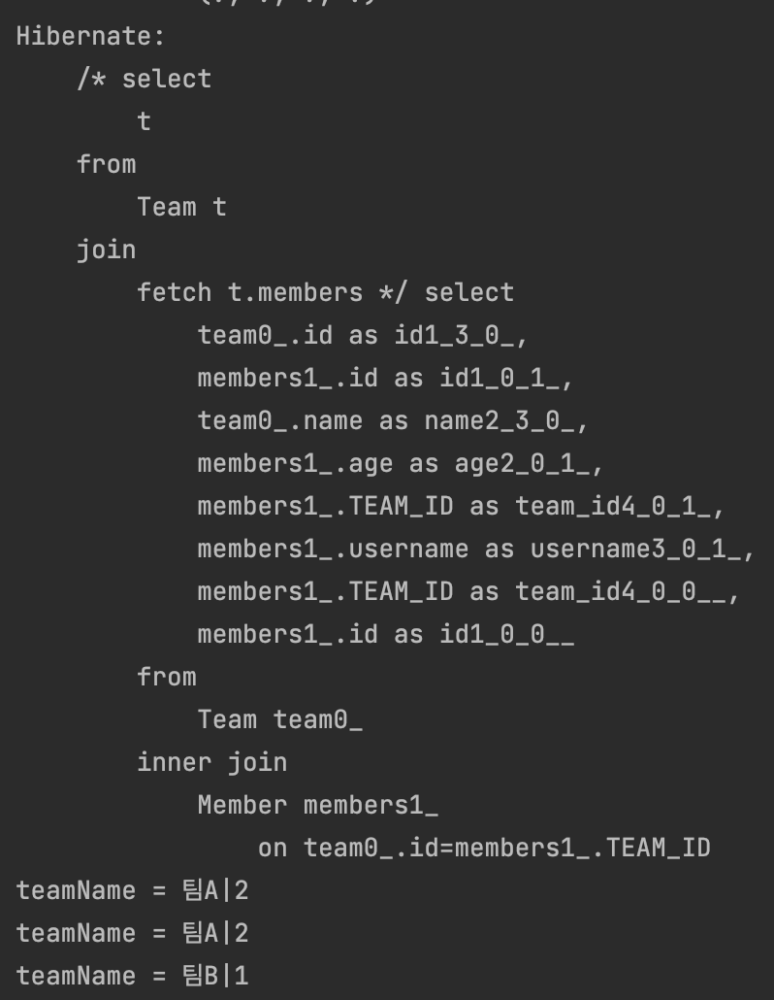 |

</br>

> 위의 예제 사진을 보면, Team과 Member를 조인하는데,  
> 이때 회원1, 회원2가 TeamA에 속해 있어 join 연산으로 인해 `중복컬럼`이 발생한다.
> `DISTINCT`를 사용해야한다!

</br>

- 페치 조인과 DISTINCT
  - SQL의 DISTINCT는 중복된 결과를 제거하는 명령
  - JPQL의 DISTINCT 2가지 기능 제공
    - SQL에 DISTINCT 추가
    - 애플리케이션에서 엔티티 중복 제거

> SQL에 DISTINCT를 추가해서  
> 애플리케이션에 올라온 엔티티가 중복일경우  
> `같은 식별자를 가진 Team Entity 제거`

</br>

- 페치 조인과 일반 조인의 차이
  - 일반 조인 실행시 연관된 엔티티를 함께 조회하지 않음

</br>

## 페치 조인 2 - 한계

</br>

- 페치 조인 대상에는 별칭을 줄 수 없다.
  - 하이버네이트는 가능, `가급적 사용 X`
    - 나와 연관된 엔티티를 가져오겠다는 것인데 추가작업을 하겠다?
    - 중간에 몇개를 가져오고 싶다? 그럴거면 아예 쿼리를 다시짜는게 맞다.

```java
String query = "select t From Team t join fetch t.members m where m.age > 10";
```

> 이런식으로 팀에서 멤버를 가져온 후 특정 조건을 통해 불러 온다?  
> 그냥 select에서 member 조건에 맞춰서 쿼리를 날려야한다.  
> Team -> 멤버들을 다 가져온다고 가정하고 설계.  
> 만약에 세 개를 가져오고 cascade나 옵션 세팅 돼있으면 어떤 문제가 발생할 지 몰라..?

</br>

- 둘 이상의 컬렉션은 페치 조인 X

> 1:N 그리고 1:N을 연달아서 다 불러오겠다?  
> 데이타 뻥튀기...  
> JPQL에서 distinct가 하는 일이 많아질듯.

</br>

- 컬렉션을 페치 조인하면 `페이징 API`(setFirstResult, setMaxResults) 사용 불가
  - 일대일 다대일같은 단일 값 연관 필드들은 페치 조인해도 페이징 가능
  - 하이버네이트는 경고 로그를 남기고 메모리에서 페이징 -> 매우 위험!

</br>

```java
String jpql = "select t from Team t join fetch t.members m";
```

</br>

|               컬렉션을 페치 조인 할 때!               |
| :---------------------------------------------------: |
| 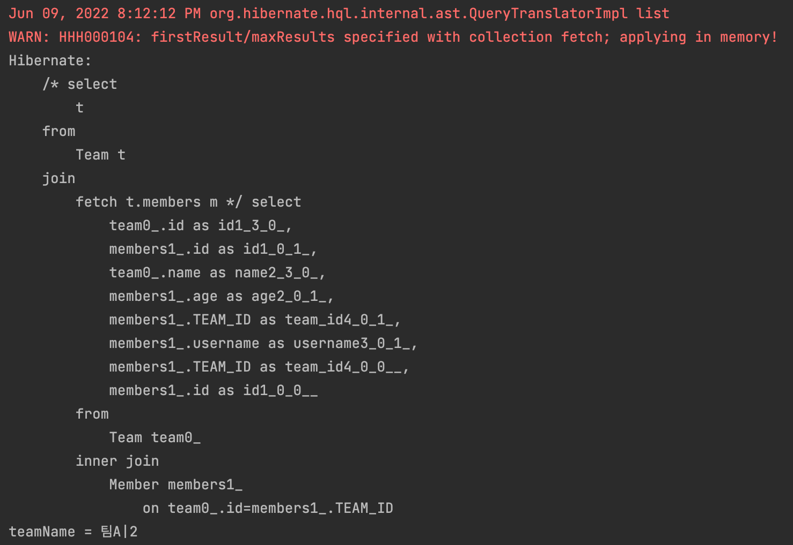 |

</br>

- firstResult/maxResults specified with collection fetch; applying in memory!

> 쿼리에서 우리가 이전에 봤던, limit가 없다... (offset은 안줬으니까 없는 것임)  
> 팀에 대한 데이터를 다 들고 온 것!

</br>

- @BatchSize

```java
@BatchSize(size = 100)
    @OneToMany(mappedBy = "team")
    private List<Member> members = new ArrayList<>();
```

```java
        tx.begin();

        try {

            // TEAM
            Team teamA = new Team("팀A");
            Team teamB = new Team("팀B");
            Team teamC = new Team("팀C");
            em.persist(teamA);
            em.persist(teamB);
            em.persist(teamC);

            //MEMBER
            Member member1 = new Member("회원1", 10);
            Member member2 = new Member("회원2", 10);
            Member member3 = new Member("회원3", 10);
            Member member4 = new Member("회원4", 10);
            member1.changeTeam(teamA);
            member2.changeTeam(teamA);
            member3.changeTeam(teamB);
            em.persist(member1);
            em.persist(member2);
            em.persist(member3);
            em.persist(member4);

            em.flush();
            em.clear();

            String jpql = "select t from Team t";
            List<Team> resultList = em.createQuery(jpql, Team.class)
                    .setFirstResult(0)
                    .setMaxResults(2)
                    .getResultList();

            for (Team team : resultList) {
                System.out.println("teamName = " + team.getName() + "|" + team.getMembers().size());
            }

            tx.commit();//4. 실제 쿼리 날아가는 시점
        } catch (Exception e) {
            System.out.println(e.getMessage() + e);
            tx.rollback();
        }
```

> org.hibernate.annotations.BatchSize 어노테이션을 컬렉션에 붙여주고  
> 페치 조인 대신에 그냥 team을 불러온다.

</br>

|           @BatchSize 실행 결과           |
| :--------------------------------------: |
| 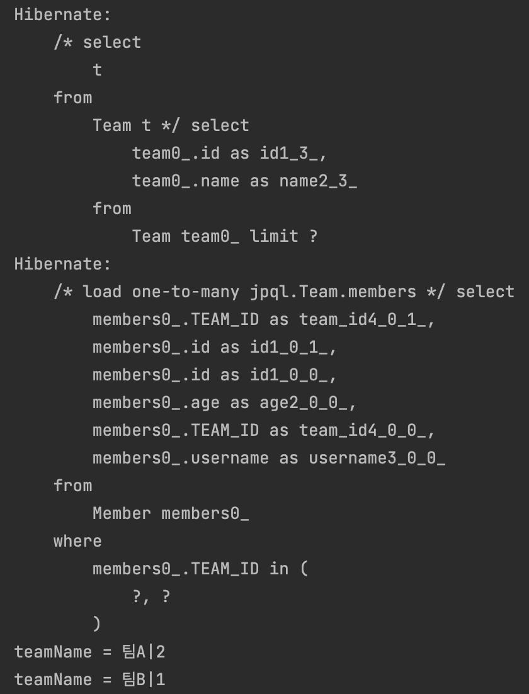 |

> @BatchSize (in 쿼리로 100개 날리겠다)
> Team 정보를 불러오고 난 후에  
> 집합 연산을 통해 Team 정보에 따른 모든 members를 조회하는 쿼리를 한 번에 날린다.  
> `현재는 멤버 3개가 갖는 team이 두 개지만, member가 무수히 많다고 가정하면 뽑아오는 데이터에 비해 쿼리만 늘어나는 현상이 벌어질 수 있다.`

</br>

|        @BatchSize 없을때 실행 결과         |
| :----------------------------------------: |
| 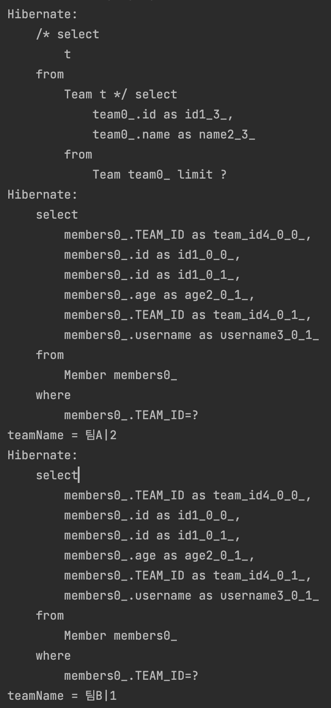 |

</br>

> @BatchSize가 없을 경우 Team 전체 정보를 불러오는 `select 쿼리`  
> 반목문을 통해서 team 정보에 따른 members `select 쿼리` -> 지연 로딩
> 그 다음 다시 또 한 번 다른 team 정보에 따른 members `select 쿼리` -> 지연 로딩

</br>

- persistence.xml option 추가

```xml
<property name="hibernate.jdbc.batch_size" value="100"/>
```

> 실무에서는 1000이하의 적절한 수로  
> 글로벌로 세팅

</br>

> 이런식으로 배치사이즈를 정하면 N+1 쿼리가 아니라  
> 테이블 수만큼 쿼리가 나간다.

- ex
  - Team 개수 + 1 : N + 1문제가
    - Team 정보 불러오고 : 1
    - 그 Team이 가지는 Member 질의 : 팀 개수 N
    - N + 1
  - Member와 Tema : 2개 쿼리로 해결

</br>

### 페치 조인의 특징과 한계 정리

</br>

- 연관된 엔티티들을 SQL 한 번으로 조회 - 성능 최적화
- 엔티티에 직접 적용하는 글로벌 로딩 전략보다 우선함
  - @OneToMany(fetch = FetchType.Lazy)
  - 이런 세팅값보다 페치조인이 우선한다.
- 실무에서 글로벌 로딩 전략은 모두 지연 로딩
- `최적화가 필요한 곳은 페치 조인을 적용`

</br>

> 굉장히 복잡한 뷰를 제외하고는 페치 조인으로 왠만하면 해결이 가능하다.

</br>

- 모든 것을 페치 조인으로 해결할 수는 없다.
- 페치 조인은 객체 그래프를 유지할 때 사용하면 효과적
- 여러 테이블을 조인해서 엔티티가 가진 모양이 아닌 전혀 다른 결과를 내야 하면, 페치 조인보다는 일반 조인을 사용하고 필요한 데이터들만 조회해서 DTO로 반환하는 것이 효과적

</br>

## 다형성 쿼리

</br>

|                       테이블                        |
| :-------------------------------------------------: |
| 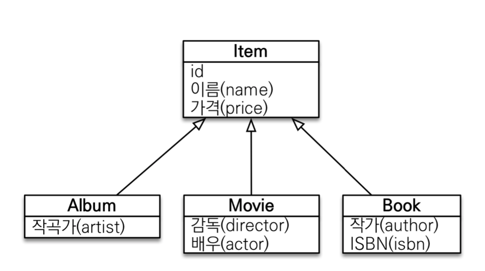 |

</br>

- 조회 대상을 특정 자식으로 한정
  - Item 중에 Book, Movie를 조회해라

</br>

- [JPQL]

```java
select i from Item i
where type(i) IN (Bok, Movie)
```

- [SQL]

```sql
select i from i where.i.DTYPE in ('B','M')
```

</br>

## 엔티티 직접 사용

</br>

- JPQL에서 `엔티티를 직접 사용하면 SQL에서 해당 엔티티의 기본 키 값을 사용`

- [JPQL] ex1

```java
select count(m.id) from Member m // 엔티티의 아이디를 사용
select count(m) from Member m // 엔티티를 직접 사용
```

```sql
<!--위의 두 결과는 아래 sql과 같다-->
select count(m.id) as cnt from Member m
```

- [JPQL] ex2

</br>

```java
// 1번
String jpql = “select m from Member m where m = :member”; List resultList = em.createQuery(jpql)
.setParameter("member", member) .getResultList();

// 2번
String jpql = “select m from Member m where m.id = :memberId”; List resultList = em.createQuery(jpql)
.setParameter("memberId", memberId) .getResultList();
```

</br>

```sql
<!--이것도 같당-->
select m.* from Member m where m.id=?
```

</br>

## Named 쿼리

</br>

- 미리 정의해서 이름을 부여해두고 사용하는 JPQL
- 정적 쿼리
- 어노테이션, XML에 정의
- 애플리케이션 로딩 시점에 초기화 후 재사용
  - 정적 쿼리로 변하지 않으니까, 캐시아웃해서 사용하니까 좋다!
- `애플리케이션 로딩 시점에 쿼리를 검증`

</br>

```java
@Entity
@NamedQuery(
        name = "Member.findByUsername",
        query = "select m from Member m where m.username = :username"
)
public class Member {
}

```

- 이건 좀 쿼리랑 Entity가 응집성이 떨어지는 듯..

</br>

```java
List<Member> members = em.createNamedQuery("Member.findByUsername", Member.class)
                    .setParameter("username", "회원1")
                    .getResultList();
```

</br>

- createNamedQuery로 실행해야함.
- name은 별로 중요하지 않으나. Entity 이름을 따라가는 것이 좋음

</br>

- persistence.xml

```xml
<persistence-unit name="hello">
        <mapping-file>META-INF/ormMember.xml</mapping-file>
```

- META-INF/ormMember.xml

```xml
<?xml version="1.0" encoding="UTF-8"?>
<entity-mappings xmlns="http://xmlns.jcp.org/xml/ns/persistence/orm" version="2.1">
    <named-query name="Member.findByUsername">
        <query><![CDATA[
            select m
            from Member m
            where m.username = :username
]]></query>
    </named-query>
    <named-query name="Member.count">
        <query>select count(m) from Member m</query>
    </named-query>
</entity-mappings>
```

</br>

- xml 항상 설정이 우선권을 가진다.
- 애플리케이션 운영 환경에 따라 다른 XML을 배포할 수 있다.

</br>

- 사실 Spring Data JPA 에서 @Query 쓰지 않나아~

</br>

## 벌크 연산

</br>

- 쉽게 insert, update 연산이라고 보자.

</br>

- 상황
  - 재고가 10개 미만인 모든 상품의 가격을 10% 상승하려고 한다.
  - JPA 변경 감지 기능으로 실행하려면 너무 많은 SQL이 수행 될 것.
    - 변경된 엔티티 마다의 update 쿼리가 날아감으로?
      - 재고가 10개 미만인 상품을 리스트로 조회한다. select
      - 상품 엔티티의 가격을 10% 증가한다.
        - 람다 써서 chaining으로
      - 트랜잭션 커밋 시점에 `쓰기 저장소에 저장한 update 쿼리 실행`
      - 변경된 데이터 `List의 size만큼 update 쿼리가 실행 될 것`

</br>

> 영한님은 JPA가 실시간성이 유리하지 bulk성에 유리한 편은 아니라고 하심.  
> 한 방에 날리는 방법?

</br>

```java

        tx.begin();

        try {

            // TEAM
            Team teamA = new Team("팀A");
            Team teamB = new Team("팀B");
            Team teamC = new Team("팀C");
            em.persist(teamA);
            em.persist(teamB);
            em.persist(teamC);

            //MEMBER
            Member member1 = new Member("회원1", 10);
            Member member2 = new Member("회원2", 10);
            Member member3 = new Member("회원3", 10);
            Member member4 = new Member("회원4", 10);
            member1.changeTeam(teamA);
            member2.changeTeam(teamA);
            member3.changeTeam(teamB);
            em.persist(member1);
            em.persist(member2);
            em.persist(member3);
            em.persist(member4);

            // FLUSH 자동 호출
            String queryString = "update Member m set m.age = m.age * 2 where m.age < 20";

            int resultCount = em.createQuery(queryString)
                            .executeUpdate();

            tx.commit();//4. 실제 쿼리 날아가는 시점
        } catch (Exception e) {
            System.out.println(e.getMessage() + e);
            tx.rollback();
        }

```

</br>

|                bulk 연산 결과                |
| :------------------------------------------: |
| 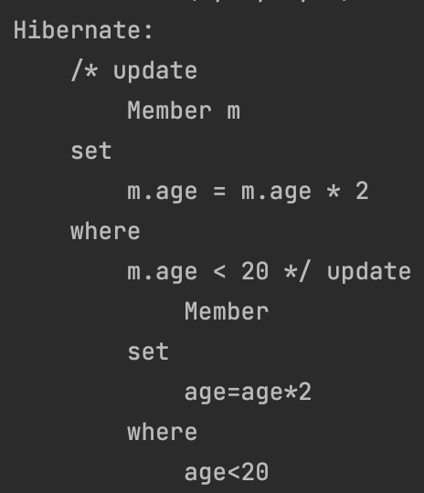 |

> Member의 나이가 20살 미만인 회원의 나이를 두 배로 증가 시켰다.
> 4번의 update 쿼리가 나가야하지만,  
> `한 번의 update 쿼리가 실행 되는 것을 확인할 수 있다.`

</br>

- 쿼리 한 번으로 여러 테이블 `로우 변경(엔티티 변경)`
- executeUpdate()의 결과는 영향 받은 엔티티 수 반환
- UPDATE, DELETE 지원
- INSERT(insert into .. select, 하이버네이트 지원)
  - JPA 표준스펙이 아니라 하이버네이트를 쓰면 가능

</br>

### 벌크 연산 주의

- 영속성 컨텍스트를 무시하고 데이터 베이스에 직접 쿼리
  - `벌크 연산을 먼저 실행`
  - `벌크 연산 수행후 영속성 컨텍스트 초기화`

```java
        tx.begin();

        try {

            // TEAM
            Team teamA = new Team("팀A");
            Team teamB = new Team("팀B");
            Team teamC = new Team("팀C");
            em.persist(teamA);
            em.persist(teamB);
            em.persist(teamC);

            //MEMBER
            Member member1 = new Member("회원1", 10);
            Member member2 = new Member("회원2", 10);
            Member member3 = new Member("회원3", 10);
            Member member4 = new Member("회원4", 10);
            member1.changeTeam(teamA);
            member2.changeTeam(teamA);
            member3.changeTeam(teamB);
            em.persist(member1);
            em.persist(member2);
            em.persist(member3);
            em.persist(member4);

            String queryString = "update Member m set m.age = m.age * 2 where m.age < 20";

            //Flush만 된상 황이라 clear하고 사용해야해
            int resultCount = em.createQuery(queryString)
                            .executeUpdate();

            // 영속성 컨텍스트에 member1의 데이터가 남아있어서, 엔티티 동일성 보장해준다..
            // clear 날려줘야해..
            Member findMember = em.find(Member.class, member1.getId());

            System.out.println(member1 == findMember);
            System.out.println(findMember.getAge());

            tx.commit();//4. 실제 쿼리 날아가는 시점
        } catch (Exception e) {
            System.out.println(e.getMessage() + e);
            tx.rollback();
        }

```

|                  망하는 결과                   |
| :--------------------------------------------: |
| 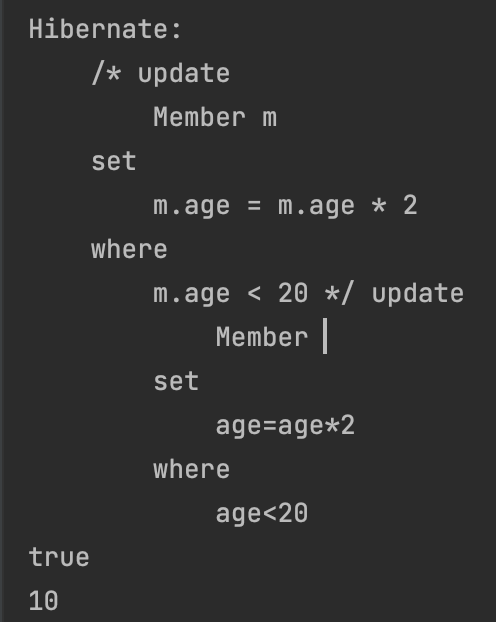 |
